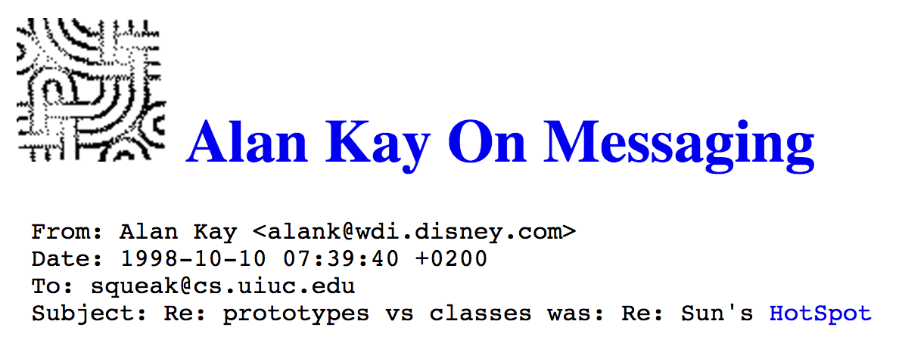

dateCreated: 2015-05-11 11:09 CET  
postTypes: summary  
tags: oop, object calisthenics, inheritance  
oldUrls: /blog/2015/05/alan-kay-on-messaging/  

# Alan Kay On Messaging

On the famous [c2 wiki] find ["Alan Kay On Messaging"][56].
His words are from the year 1998 and still so true. 
And I am only close to the beginning of really understanding.
But I have to, as usual, extract some of the key points for me.
Make sure to read the entire message anyways, it's really very short!

 <em>Header of Alan Kay's message</em>

> I'm sorry that I long ago coined the term "objects" for this topic because it gets many people to focus on the lesser idea.
> The big idea is "messaging" - that is what the kernel of Smalltalk/Squeak is all about (and it's something that was never quite completed in our Xerox PARC phase).

This just means: make sure to understand how he means OO should be done. 
Need a starting point? Read [poodr] and listen to [Sandi Metz]'s various talks [findable online][57-1].

Inherently, once scratched on the surface of what OO means and reading about [object calisthenics][57] 
the question what is inheritance will stick out.  
And Alan Key writes about it:

> I would say that a system that allowed other meta things to be done in the ordinary course of programming (like changing what inheritance means, or what is an instance) is a bad design.

Two questions are raised here:
1. What does inheritance mean?
2. What is an instance?

/me has to go and read and answer those ...
And work on improving what he calls to be 

> Given the current low state of programming in general

(which I understand as: most programming done nowadays is "bad" (that's how I interpret "low state") - maybe I am wrong)

[poodr]: http://poodr.com
[Sandi Metz]: https://twitter.com/sandimetz
[57]: http://williamdurand.fr/2013/06/03/object-calisthenics/
[57-1]: https://www.youtube.com/results?search_query=sandi+metz
[56]: http://c2.com/cgi/wiki?AlanKayOnMessaging
[c2 wiki]: http://c2.com/cgi/wiki
