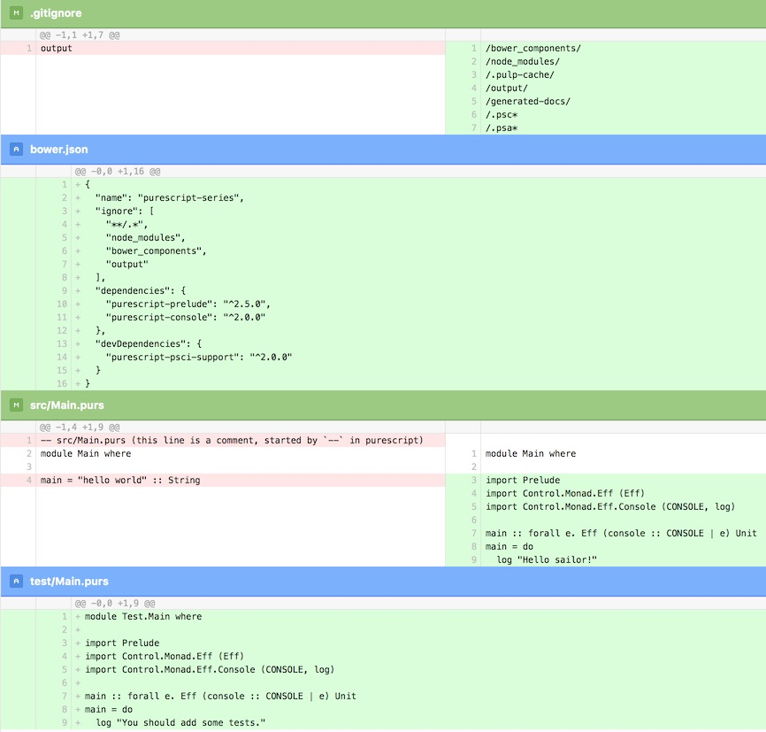

dateCreated: 2017-03-07 22:31 CET  
tags: purescript, notes, yarn, pulp, build tool  
postTypes: post  
oldUrls: /blog/2017/03/purescript-build-tool-pulp-3/  

# Purescript build tool - pulp #3

In the last [part #2 of the purescript series][ps#2] I got Purescript and it's executable
installed, using yarn. Pulp seems to be the default *"build system and package manager for PureScript projects"*
as [Bodil Stokke][bodil] states in her [1st commit][pulp-1st-commit] to the project.
Let me explore it a bit.

[ps#2]: /blog/2017/03/install-purescript-2/
[pulp-1st-commit]: https://github.com/bodil/pulp/blob/3a7d61bd0b110ff92b0d541a1c263e4fb9136fc1/package.json#L4
[bodil]: https://twitter.com/bodil

After having explored a tiny bit of Purescript in the last post, I want to build stuff
now. The [book says to install bower and pulp][book-install], I just do that a bit different, by using 
yarn for it and not installing the packages globally.  
NOTE: If you still prefer installing it globally, use
[*`yarn global`*][yarn-global] instead of `yarn` for running yarn commands.
```shell
> yarn add bower --save
yarn add v0.15.1
# ...snip...
└─ bower@1.8.0
✨  Done in 4.33s.
# ...snip...
> yarn add pulp --save
# ...snip... maaaaany lines (means many dependencies) :)
✨  Done in 6.30s.
```
I don't worry too much about bower yet, I want to see what pulp can do :).

## Pulp - [*"A build tool for PureScript projects"*][pulp]

As mentioned in the last post, we have `./node_modules/.bin` in our PATH,
which allows us now to run `pulp`, which executes the binary located in there.
Let's see what pulp has to offer:
```text
> pulp
* Error: Expected command
Usage: pulp [global-options] <command> [command-options]

Global options:
  --before <string>       Run a shell command before the operation begins. Useful with `--watch`, eg. `--watch --before clear`.
  --bower-file -b <file>  Read this bower.json file instead of autodetecting it.
  --else <string>         Run a shell command if an operation finishes. Useful with `--watch`, eg. `--watch --then 'say Done' --else 'say
                          Failed'`
  --help -h               Show this help message.
  --monochrome            Don't colourise log output.
  --then <string>         Run a shell command after the operation finishes successfully. Useful with `--watch`, eg. `--watch --then 'say
                          Done'`
  --version -v            Show current pulp version.
  --watch -w              Watch source directories and re-run command if something changes.

Commands:
  browserify  Produce a deployable bundle using Browserify.
  build       Build the project.
  docs        Generate project documentation.
  init        Generate an example PureScript project.
  login       Obtain and store a token for uploading packages to Pursuit.
  psci        Launch a PureScript REPL configured for the project.
  publish     Publish a previously tagged version to Bower and Pursuit.
  run         Compile and run the project.
  server      Launch a development server.
  test        Run project tests.
  version     Bump and tag a new version in preparation for release.

Use `pulp <command> --help` to learn about command specific options.
```
I mentioned it in the first post of this series, that Purescript can also be compiled
to browser-compatible code, that is what the `browserify` command will do. Exciting imho.
I assume the `build` command will just build it to commonjs, which I could then use
in nodejs. We will see.  
I want to try to apply my little knowledge of Purescript on the shell, so I run `pulp psci`.
```shell
> pulp psci
* ERROR: No bower.json found in current or parent directories. Are you in a PureScript project?
```
Alright, so it might be time to really do `pulp init` as the book suggests, even `pulp version`
shows this error message. Fine. Convinced. I just wanted to play a little bit :).
```text
> pulp init
* Generating project skeleton in /Users/wk/purescript-series
* ERROR: Found /Users/wk/purescript-series/.gitignore: There's already a project here. Run `pulp init --force` if you're sure you want to overwrite it.
```
Actually that is true, since I had been playing before and did add this `.gitignore`
file. Ok, so let's force it.
```text
> pulp init --force
* Generating project skeleton in /Users/wk/purescript-series
bower purescript-prelude#*      cached https://github.com/purescript/purescript-prelude.git#2.4.0
bower purescript-prelude#*    validate 2.4.0 against https://github.com/purescript/purescript-prelude.git#*
bower purescript-console#*      cached https://github.com/purescript/purescript-console.git#2.0.0
# ...snip...
```
<div style="float: left; padding: 1rem;">

<br/><em>The diff after `pulp init`</em>
</div>
Oh, wow this created some stuff. I was looking at the 
[source code of `pulp init`][pulp-init-src] and saw that some new files
will be created. Instead of going through each of them and pasting all the code here, 
see the diff (as an image on the left). I see that my `Main.purs` was
overridden by more complex Purescript code. Not sure if I will keep that :).
Next the book suggests to write (or paste) a short Purescript script into `Main.purs`,
finally a real hello-world. Yeah.
```text
module Main where

import Control.Monad.Eff.Console

main = log "Hello, World!"
```
And now I want to see that one running! So `pulp run` is the right thing.
But wait, I will take baby steps, so let me run `pulp build` before, it should 
do what I expect, just build the source and do two things:
1. verify our source code and throw a warning  for the missing type annotation and
2. generate the source code into the `output` directory.

And it does. The output is verbose and shows what gets compiled and as expected
a warning. I already know from the last post that `main` without a type annotation
will give a warning, and it does.
```shell
> pulp build
* Building project in /Users/wk/purescript-series
Compiling Data.NaturalTransformation
# ...snip...
Compiling Control.Monad.Eff.Console
Compiling Control.Monad.Eff.Unsafe
Compiling Main
Compiling PSCI.Support
Warning found:
in module Main
at /Users/wk/purescript-series/src/Main.purs line 5, column 1 - line 5, column 12

  No type declaration was provided for the top-level declaration of main.
  It is good practice to provide type declarations as a form of documentation.
  The inferred type of main was:
                            
    forall t1.              
      Eff                   
        ( console :: CONSOLE
        | t1                
        )                   
        Unit                
                            

in value declaration main
# ...snip...
* Build successful.
```
Confirmed. The compiler complains about `main` and the missing type declaration.
The build succeeded. And the source should have a `console.log` in it.
```shell
> cat output/Main/index.js 
// Generated by psc version 0.10.7
"use strict";
var Control_Monad_Eff_Console = require("../Control.Monad.Eff.Console");
var main = Control_Monad_Eff_Console.log("Hello, World!");
module.exports = {
    main: main
};
```
And so it does. Awesome.
Now just to make confirm, I run `pulp run`. And it should execute the compiled
source.
```text
> pulp run
* Building project in /Users/wk/purescript-series
* Build successful.
Hello, World!
```
Yep. It printed hello-world.
Enough for now. The build tool works and I have seen a proper hello-world.

In the next post I will finally open the REPL and play a little bit with
Purescript and afterwards I plan to try out the different building options,
such as building it with browserify for a browser compatible JS file.

[pulp-init-src]: https://github.com/bodil/pulp/blob/master/src/Pulp/Init.purs
[pulp]: https://github.com/bodil/pulp
[book-install]: https://github.com/paf31/purescript-book/blob/master/text/chapter2.md#installing-tools
[yarn-global]: https://yarnpkg.com/en/docs/cli/global
