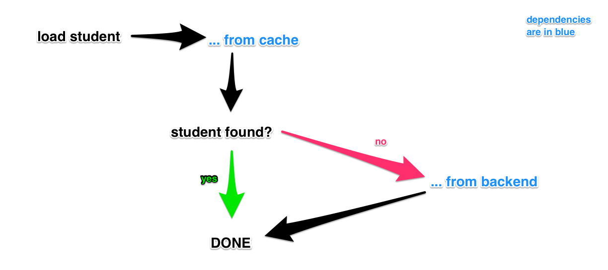

dateCreated: 2017-03-18 11:05 CET
tags: javascript, dependency injection, testing
postTypes: post

# Discover and extract dependencies

While refactoring some badly tested code, a pattern of how I extract dependencies emerged. 
The actual intention was to improve the testability. In this case dependency injection is the tool that helped me.
Read here to find out the steps I found to separate the dependencies.

## The pattern that emerged (the quick version)

From this article you may learn that those steps are all that is necessary in order
to get a better feeling on the dependencies of your code, how to separate them and
make the code easy to test.

The steps are:

1. Write a first test
1. Find and use first dependency in test
1. Isolate dependencies
1. Provide production/default dependencies

And you end up with 
- fast and small tests
- separated dependencies
- maybe hints for how to modularize your code

## The task

<div style="float: left; padding: 1rem;">

<br/><em>loadStudent function flow</em>
</div>

I want to show how to separate dependencies that might not been obvious at first. And 
by adding tests I will "feel" them. And I will be pushed to separate them out. Which makes
my code easier to test and also make me understand what (external) dependencies the code has.

I broke down the original code, to really make the actual dependencies stick out.
The code loads some data, a student in this case. To speed up performance
the student is first read from a cache, if that fails it is loaded from a (slower) backend.

Let's get started.  
This code was **missing tests**. So I will start to add them.
The starting point was the following code.

```js
import { fetch } from './backend';

const cache = {};
const loadStudent = ({ studentId }) => {
  if (!cache[studentId]) {
    cache[studentId] = fetch({ studentId });
  }
  return cache[studentId];
};
```

## First test

The first test I wrote was for the cache ([see the commit][first-test]). Actually I am not sure it's the right
test to write, since the fetch is more important. But anyways. I follow
the code's flow.

```js
describe('Load a student', () => {
  it('from the cache', () => {
    cache[42] = 'student 42';
    const student = loadStudent({ studentId: 42 });
    assertThat(student, equalTo('student 42'));
  });
});
```

The first thing that jumps out is the sharing of the ***global*** `cache` variable.
The production code and the test share it now through the access of a global variable. Scary.
This is not good. In this case I want to have the cache under control, so I need
to inject it. That is my first conclusion and the first dependency I found.
NOTE: first dependency `cache`.

## Isolate first dependency

I rewrite the test (and make it fail), I pass the `cache` into the function as a parameter 
([see the commit][inject-cache-commit]).
I isolate the first dependency. At least for the test it is isolated now.

```js
it('from the cache', () => {
  const cache = { 42: 'student 42' }; // <<< no more globals :)
  const student = loadStudent({ studentId: 42, cache });
  assertThat(student, equalTo('student 42'));
});
```

To make this test green I need to change the production code. I need to 
use the cache as given via parameter.

I am going to change the production code, the function `loadStudent()` without
having it fully covered with tests. The `fetch()` method is not tested yet at
all. True. I am fine with that for now.

```js
const loadStudent = ({ studentId, cache }) => {
  if (!cache[studentId]) {
    cache[studentId] = fetch({ studentId });
  }
  return cache[studentId];
};
```

No more global `cache` variable. Great for testability. But actually the 
real cache functionality got lost. Since there is no global cache anymore. Right.
That is a real issue. I will cover this in a second. Hold on! Let's clean up a bit first.

## Separating dependencies

First I would like to refactor the code a little bit. The parameters 
are nice and the destructuring makes it nice to have named parameters.
But I think that `studentId` and `cache` are two different kind of parameters.
The `studentId` is the actual parameter that this function requires in order
to do something useful. And the `cache` is an injected dependency.
I want to make that clear in the function. So I split them ([the commit][separate-params-commit]).

```js
const loadStudent = ({ studentId }, { cache }) => {
  // ...
};  
```

And since I am a fan of explicitness I prefer to not destructure the second
parameter, but to name the entire thing, like so ([commit][explicit-deps-param-commit]):

```js
const loadStudent = ({ studentId }, dependencies) => {
  // ...
};  
```

This will bubble through the code and inside the function `cache` will need
to be replaced by `dependencies.cache`. Which is more to write but every 
reader of the code will benefit from it. It will be clear that the cache 
is a dependency and is not a main concern of this function. And how the 
cache works is nothing of importance in here. I personally like that and think
it adds value to the code for any future reader.

## Discover second dependency, the `fetch()` function

Let's tackle one of the open issues, which is testing the `fetch()` function.
It is a global function, currently. So we are treating it as a nasty global
function for now, and just overriding it in the following test ([commit][first-fetch-test-commit]).

```js
it('fetch the student if not in the cache', () => {
  let emptyCache = {};
  fetch = () => 'student 23';
  const student = loadStudent({ studentId: 23 }, { cache: emptyCache });
  assertThat(student, equalTo('student 23'));
});
```

We **know** now that `fetch()` is used inside of `loadStudent()`. And that knowledge
is not in our test, that is nasty too. We need to make that obvious.

## Inject the second dependency

We make this obvious by (just say it with me), yes, correct: **injecting the dependency** ([commit][inject-fetch-commit]).

```js
it('fetch the student if not in the cache', () => {
  const emptyCache = {};
  const dependencies = { cache: emptyCache, fetch: () => 'student 23' };
  const student = loadStudent({ studentId: 23 }, dependencies);
  assertThat(student, equalTo('student 23'));
});
```

See `fetch()` is passed in the `dependencies` object. And no global is overridden anymore.

## Provide production dependencies

Now we have all the dependencies identified. We have `cache` and `fetch()` (even though `fetch` is a pretty bad name).
Those two dependencies can be injected, the function works using them.
Now we should not just have the tests run, but also the production setup.
And for that we need to provide the dependencies to it too.

How? Let's try an integrated test for it, one that takes a working cache and a working `fetch()` 
function as given ([commit][integrated-test-commit]).

```js
describe('Load a student', () => {
  it('from the cache', () => {
    const student = loadStudent({ studentId: 42 });
    assertThat(student, equalTo(''));
  });
});
```

As you can see, this test assumes 1) there is no student with the ID 42 and 2) a fetch for this student returns 
an empty string. Yep, we are assuming to have these external dependencies under control that we **know** those
things. 

Deploying this and having it run in a real CI environment there might be a bit more setup to make
in order to get those integrated tests provided with the right data. And it might also be a bit more
work to get them stable. That's why one should very well figure out what the right set of (mostly happy path)
tests is. And if you throw many of them at your code, do also think that they must stay maintainable!
This one here serves as an example for understanding that a safe software might not only consist of 
tiny and small tests (I am preventing the polluted name "unit tests").

To get this test green, we set up the default dependencies that our production environment will use.
There is many other ways of injecting dependencies. The following worked quite well for me until now ([commit][default-deps-commit]).
Though remember to try to keep the dependencies to be injected as tiny as possible and it will serve you well.

```js
const defaultDependencies = () => {
  return { fetch, cache };
};

const loadStudent = ({ studentId }, dependencies = defaultDependencies()) => {
  // ...
};
```

As you see above, I define the `defaultDependencies` above the function. Mostly those consist
only of some imported items. One could go further and move this out and just inject a structure into this file.
I saw it working well until now with this less generic, more explicit approach and allowing 
the reader (of the code) to see what the dependencies consist of, right where they are used.

Why a function `defaultDependencies()` and not just a simple object? Simple answer, a function
makes it lazy. Until the dependencies are not needed they don't get resolved, this might 
dribble down the call stack. And it also allows for configuring a dependency, if necessary.

## What's left?

The variable `cache` is a very simple, very stupid cache now.
Which is quite cool. But thinking about a cache, there might be more to it.
I might want to create a simple API for the reading from and writing to the cache.

The `fetch()` as such is a very generic name. But it could be named better, something
like `readFromBackend()` or `loadStudentFromStorage()`. That there might just be the
simple `fetch()` function behind it, is secondary.

Maybe making it asynchronous would be a nice add-on. It would be very easy, but unfortunately
this involves also changes in the test code. But that is the nature of JavaScript, it 
can not simply hide asynchronicity in code.

## Conclusions

Separating dependencies can be done by writing tests for untested code.
It looks like it blows up the code? Think again! It also decouples your code in the places
where you might not want it coupled. Decoupling is just like every person using a different glass when
drinking from the same bottle, in order to not share all germs. It's pure hygiene.

[first-test]: https://gitlab.com/wolframkriesing/article-discover-extract-dependencies/commit/a3dba52ce7789c5517ceb60f953cfa33bb6ad499
[inject-cache-commit]: https://gitlab.com/wolframkriesing/article-discover-extract-dependencies/commit/2c485ba353c252e913d8430a49cda39894f30431
[separate-params-commit]: https://gitlab.com/wolframkriesing/article-discover-extract-dependencies/commit/a17fec979562c0d58311b87bf431a8542878212f
[explicit-deps-param-commit]: https://gitlab.com/wolframkriesing/article-discover-extract-dependencies/commit/ce657f84069e27a4640c8fa0759b7fe7a5bf2bae
[first-fetch-test-commit]: https://gitlab.com/wolframkriesing/article-discover-extract-dependencies/commit/aaf3278c68aaf39b060585b9b309f3a1295a0bbc
[inject-fetch-commit]: https://gitlab.com/wolframkriesing/article-discover-extract-dependencies/commit/9d808180666de271e1c7a37e4e2a4f96add0b08f
[integrated-test-commit]: https://gitlab.com/wolframkriesing/article-discover-extract-dependencies/commit/5f18dfbdc69fc38f4ee636f04aac286072ecdac8
[default-deps-commit]: https://gitlab.com/wolframkriesing/article-discover-extract-dependencies/commit/b58a9de0424f16b58a50b422c6c49e27d8f0c101
