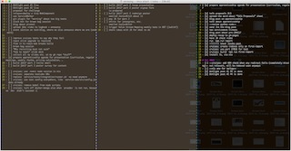

dateCreated: 2017-11-03 18:15 CET  
postTypes: post  
tags: mikado method, tmux, vi, vim, learning, apprentice  
oldUrls: /blog/2017/11/mikado-method-to-install-a-vim-plugin/  

# Mikado Method to install a Vim Plugin

I just wanted to install a github-flavored markdown plugin for vim. 
Until today I only used vim as it falls out of the box. So I had to do a couple 
detours before I got a vim plugin installed. Since I like the simplicity of the Mikado 
Method I apply it very often (maybe too often). In this case I used a very simple form 
of it, actually mainly to document all the steps I had to take on this detour. Read more below.

## tmux's fault

<div style="float: left; padding: 1rem;">

<br/><em>personal kanban using tmux and vim</em>
</div>

A little bit of background story:
It all started last night, after another round of discussing an apprenticeship program at HolidayCheck. And since I [learned at 8th Light][learning-from-8thlight] that tmux and vim are the two essential tools every apprentice learns, I fianlly wanted to sit down and learn those tools too.  
I tweeted that I had found a [great tutorial][tmux-tutorial] to install tmux (see related-tweets in the side bar). So I went along and actually got started pretty fast on using tmux. I went to bed happily, I had learned all I needed to get started with tmux in less than one hour.  
And in the morning I had the glorious idea to switch to tmux and vim for maintaining my private kanban board. I wanted to have three panes, the backlog, in progress and done column and in each I have a file open, which I edit using vim. This way I can learn tmux and vim, both at the same time.  
Actually I had started using vi, not vim. But I switched to vim, when I found no vi plugins, but only vim plugins. And another bit later I found out that vi is no more than a symlink to vim, at least on my machine :).

[learning-from-8thlight]: http://techblog.holidaycheck.com/post/2017/10/02/learning-from-8thlight
[tmux-tutorial]: http://www.hamvocke.com/blog/a-quick-and-easy-guide-to-tmux/

## Vim Plugin and Mikado Method?

Having my three columns prepared I only needed a github-flavored markdown editor for some syntax highlighting. And the github style enables the nice checkbox style (`- [ ] ...`) that I use even in any regular markdown files. And to highlight those properly, I needed the right plugin for vim.  
After a while I figured out, this is a rabbit whole for a vim beginner like me.

Every time I start making two or more extra steps before reaching the actual goal right away (here installing the vim plugin which highlights github-flavored markdown properly) I think of the [Mikado Method][mikado-method]. It's for one perfect for documenting all things and also for structuring and not forgetting the essential things when climbing back out of the rabbit hole. Actually it can be applied in many more (complex) contexts as described in the linked article, but I found it also helps structuring in getting things done and not forgetting what I actually wanted to do.

A couple of dependent steps were necessary to install the vim plugin. And in order to not loose focus and not forget a step that would come next but gets overruled by a sub-step of the current one I use the Mikado Method.

[mikado-method]: https://pragprog.com/magazines/2010-06/the-mikado-method

## Install vim-plugin

Here are the steps I had to do to explore how to get this vim plugin installed on a "fresh" vim.

- ❓I want a github-flavored markdown syntax highlighter for vim
  - first thing: start a [search for "github flavored vim plugin"][search-for-plugin]
  - the plugin [vim-gfm-syntax] seems the way to go
  - ❓ I want to install the vim-plugin 'vim-gfm-syntax'
    - looking for the *Install* section on the github page makes me feel dumb, looks like I am the only one who doesn't know how to install it, that's why it has not *Install* section
    - ❓ I want to learn how to install this vim plugin
      - reading through the readme, I found out that this package is an improvement of the [vim-flavored-markdown]
      - I figured that I might install instructions there
      - I went to the  I have to go to it’s parent package (because vim-gfk-syntax has no install section) https://github.com/jtratner/vim-flavored-markdown
      - there it says: ["Install - Best way - use Pathogen"][install-best-way]
      - ❓ I want to understand if pathogen is the vim plugin manager I need
        - so I [searched for "vim pathogen"][search-pathogen]
        - found https://github.com/tpope/vim-pathogen
        - but the first sentence "Manage your 'runtimepath' with ease." means nothing to me
        - reading on ... "In practical terms, pathogen.vim makes it super easy to install plugins and runtime files in their own private directories."
        - 👍 pathogen is the plugin manager I want
      - ❓ I want to install pathogen, the vim plugin manager
        - installed pathogen as described in https://github.com/tpope/vim-pathogen#installation
        - add this to the ~/.vimrc
          ```
          execute pathogen#infect()
          syntax on
          filetype plugin indent on
          ```
          as described here https://github.com/tpope/vim-pathogen#runtime-path-manipulation
        - "Now any plugins you wish to install can be extracted to a subdirectory under ~/.vim/bundle, and they will be added to the 'runtimepath'" ... now runtimepath does also make sense :)
        - 👍 pathogen is installed
    - 👍 in ["Install - Best way - use Pathogen"][install-best-way] it says how I install a package !!! watch out we want to install https://github.com/rhysd/vim-gfm-syntax though
  - 👍 so I install the plugin
    ```
    $ cd ~/.vim/bundle
    $ git clone https://github.com/rhysd/vim-gfm-syntax.git
    ```
- 👍 try it out, open the file via `vim some.md` (especially one with github-style check boxes `- [ ] ...` and ... I can see it highlighted ... yeah 
- 👍 DONE, "pure joy"

[search-for-plugin]: https://duckduckgo.com/?q=github+flavored+vim+plugin 
[vim-gfm-syntax]: https://github.com/rhysd/vim-gfm-syntax
[vim-flavored-markdown]: https://github.com/jtratner/vim-flavored-markdown
[search-pathogen]: https://duckduckgo.com/?q=Pathogen+vim
[install-best-way]: https://github.com/jtratner/vim-flavored-markdown#best-way---use-pathogen

## Finally

It's true, the Mikado Method explained in [the article][mikado-method] is way more sophisticated. But doing those tedious things like learning to install a vim plugin always reminds me of the Mikado Method. And since I usually write down my "Mikado steps" using nested lists, like in here, this is the simplest form of using the Mikado Method.  
Have fun trying it, it can really safe ones sanity and keep you focused.

related_tweets:

<blockquote class="twitter-tweet" data-lang="de"><p lang="en" dir="ltr">Finally I did `nix-env -i tmux` (install tmux) and running through this nice tutorial. <a href="https://t.co/YlgNPeoddr">https://t.co/YlgNPeoddr</a><br>Easy to be convinced.</p>&mdash; programmer@work (@wolframkriesing) <a href="https://twitter.com/wolframkriesing/status/926197729931464705?ref_src=twsrc%5Etfw">November 2, 2017</a></blockquote>
<blockquote class="twitter-tweet" data-partner="tweetdeck"><p lang="en" dir="ltr">just 20min later and I got a &quot;Congratulations, you’ve just completed your first tmux session&quot; that feels like achievement :) thx <a href="https://twitter.com/hamvocke?ref_src=twsrc%5Etfw">@hamvocke</a> <a href="https://t.co/fcX2QsPHXH">https://t.co/fcX2QsPHXH</a></p>&mdash; programmer@work (@wolframkriesing) <a href="https://twitter.com/wolframkriesing/status/926199416872144896?ref_src=twsrc%5Etfw">November 2, 2017</a></blockquote>


