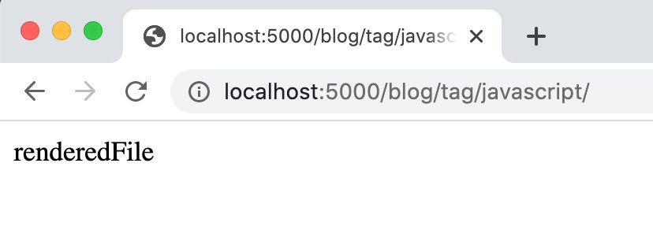

dateCreated: 2020-04-19 11:33 CET  
tags: speed, build process, metrics  
aboutProject: site-stitcher  

# Speed up the Build Process

The other day in a tweet I meant to say that thinking about how to partially build a project is 
time spent wrong. Speed up the entire build process instead. That's what I am starting now for 
[site-stitcher, the project that builds this blog][3].

<blockquote class="twitter-tweet"><p lang="en" dir="ltr">If I start thinking about how to partially build my project my build process is too slow.<br><br>It would just be much more complexity added and try to cover up the actual flaw.</p>&mdash; @wolframkriesing <a href="https://twitter.com/wolframkriesing/status/1250736234189766657?ref_src=twsrc%5Etfw">April 16, 2020</a></blockquote>

!!!!!!!!!! index goes here !!!!!!!!!!

Here I am. I got to the point that my fan just made my machine take off, at least it sounded like.
That was while I was running `npm run dev:start` which I use to continuously build the posts you are looking at, 
it uses a special [`inotifywait` setup][2] which runs the build process every time one file
changes, no throttling or anything. Now imagine you switch git branches. That triggered me to dig into the
speed of the build process.\
Blame it on me having a Mac and [using a Docker setup][1], 0:1 against me, totally right, but that's a different
battle field, that I will come back to eventually.

The worst notable thing is that I start preventing to use `npm run dev:start` the automated rebuild on demand,
which is actually made for assisting me. Instead I went back to use `npm run start` which does one build
and start the webserver to serve my site locally, and I stop and restart this script once I want to see my
updates being built.

## Deciding what to fix
The above introduction shows that there is not only one thing I could optimize, there is not only the
speed of the build process. I could also:

1. get a computer where Docker runs faster and more natively, e.g. a Linux machine - that will happen some day
1. fix the "inotifywait" usage to use some throttling and build not on every file change but just at most once 
  a second or something like that
1. optimize the watcher to build just the changed files and finally
1. speeding up the build process itself.

Item 1. will happen sooner or later (I am saying that to myself for 10 years already, so I am confident, hehe).
Fixing 2. is something I looked up and did not find an option on "inotifywait" man pages, I might be able to
do it with linux tooling but I experience myself wasting a lot of time in digging into that, so I avoid this
rabbit hole now.

I am definitely not going to do 3. since this feels just counter intuitive to me. Why should I circumvent
the slow process by adding more code that might do it wrong. And that actually just tries to prevent running
the slow process. Just imagine all the dependencies that there
are across pages, when a tag changes the according tag pages need to be built, the month pages and others.
Nope that is the wrong
way, and I have seen live-reload/rebuild tools do bullshit that makes you either say 
"oh just restart, the live-reloading has gone mad" which is just another burden, or even worse you start digging
into your code to figure out what's broken until you realize the live-reload screwed it up. 

I am going with option 4., I am fixing the actual core of the build process to be faster, I will benefit
from that in many more ways.
Let's see how this turns out, since I am writing this before I actually do write any code.

## Rough Analysis

The time it takes to build my entire blog is also too long, I feel. The thing that really sucks is that
it will become slower with every new post I am writing (like this one) and every feature I add to the blog.
So I added the simplest timing I know of, using `console.time()` and `console.timeEnd()`, see [the commit here][4].
The output was this:

```text
Load source files: 134.814ms
Load blog posts: 314.913ms
Relate and group posts: 134.019ms
All posts: 1.533s
All 301 pages: 537.786ms
About page: 27.615ms
Home page: 30.993ms
404 page: 14.434ms
Tags pages: 1.802s
Month pages: 207.332ms
```

At this point in time there are 142 blog posts and 224 tags. Each of them generates at least one HTML page and there
are more pages generated. The following tasks are the most relevant and time consuming:

* A blog has a page each (`All posts: 1.533s`)
* a tag has a page each (`Tags pages: 1.802s`)
* every month has a page listing all posts of that month (`Month pages: 207.332ms`)
* some posts had a different URL on the old setup, so I generate 301 pages for the (`All 301 pages: 537.786ms`)
* before building any HTML page can be done all the blog posts are being loaded (`Load blog posts: 314.913ms`)

It is not surprising that the timings for those parts that really generate the most pages
(all the posts + all tags pages = 142 + 224 = 366 pages) are the slowest.
But as I had learned I must always just **optimize the slowest first, measure again and go again for the slowest then**
(and by then it might be something else that is slowest).

## Easy and Fast Metrics 

Once I start having numbers I can't stop diving deeper into them.
So I start by looking at [the code that build the tag pages][5] 
(it is similarly structured to [the code that generates all posts][6]).
Both functions just do three "maybe slow" things:
```javascript
  const destDir = path.join(__dirname, '../_output', post.url); // fast
  await fs.promises.mkdir(destDir, {recursive: true});          // maybe slow
  const destFilename = path.join(destDir, 'index.html');        // fast
  const renderedFile = tundra.getRender('post.html', {...defaultRenderParams, post}); // maybe slow
  await fs.promises.writeFile(destFilename, renderedFile);      // maybe slow
```

### Measure Filesystem Access
I will turn off the `fs.promises` things, since they go onto the filesystem and that can not be fast, right?
The time that it took just now (before I save this change to this blog posts markdown file)
to build all the tag pages was "2.293s". I ran it a couple of times, it was always around 2.4seconds.
Now let me comment out the fs operations. 

```javascript
  const destDir = path.join(__dirname, '../_output', post.url); // fast
//  await fs.promises.mkdir(destDir, {recursive: true});        // maybe slow
  const destFilename = path.join(destDir, 'index.html');        // fast
  const renderedFile = tundra.getRender('post.html', {...defaultRenderParams, post}); // maybe slow
//  await fs.promises.writeFile(destFilename, renderedFile);    // maybe slow
```

The last time after (of course) running it a couple of times
was "1.329s". Roughly each of them was around 1.4seconds. That means about 1 second faster. Nice learning.
Though with 1.4 second we are already much better, there is still a lot of beef left.

### Measure Template Rendering
Let's look at the third "maybe slow" thing. The template rendering.
We know the numbers from before, 2.4 seconds it takes about to render all tags pages.
Now let me comment out only the template rendering code.

```javascript
  const destDir = path.join(__dirname, '../_output', post.url); // fast
  await fs.promises.mkdir(destDir, {recursive: true});          // maybe slow
  const destFilename = path.join(destDir, 'index.html');        // fast
//  const renderedFile = tundra.getRender('post.html', {...defaultRenderParams, post}); // maybe slow
  await fs.promises.writeFile(destFilename, 'renderedFile');    // maybe slow
```

<figure class="float-right">
    
    <figcaption>Page really renders &quot;renderedFile&quot;</figcaption>
</figure>

It first failed because on the last line I referred to `renderedFile`. After I made this be `'renderedFile'`
we render files containing only that string, but for the measuring purpose, to understand the gross impact
that is fine, I would say.\
Running this a couple of times, the numbers did suprise me a little bit. Now the script measures
"671.773ms" for the last run, in average I saw always numbers around 700ms. There is a huge potential
here. Very interesting.

### Recap
Let's recap quickly what we learned about the easy measurements.

| action | before | after | win | gain |
| --- | --- | --- | --- | --- |
| Turn off `fs.promises` functions | 2.4s | 1.4s | 1.0s | 42% | 
| Turn off template rendering | 2.4s | 0.7s | 1.7s | 71% |

There is a lot of potential in the template rendering times. The good thing is, every page render will benefit from that.
As calculated above, that is 336 pages, so optimizing this can cause big gains in speed.

## Any Quick Fixes?

Regarding the filesystem access, I have no huge idea right now if there is potential.
I can think of some little things, but I know that eventually the stuff needs to get written to the filesystem and
as far as I remember (from the 2009 jsconf) nodejs is already quite good at this.
Anyways, I can imagine to have a look into the following:
* Use node workers, kinda WebWorkers just for nodejs, just not sure if this really will speed up fs access.
* I can pull out the `fs.promises.mkdir` that is currently done for every file and not every file needs a new
  directory or the directory exists already, so I can pull this out and do it just once per directory, this won't 
  be a huge gain I assume, but would be nice to clean up anyways.
* I am not sure if streams can be of help here, I would need to read more into it.
* More ideas?

The template engine numbers are actually even way more exciting and there I remember that there was a [cache option][7].
So let me try to turn this on and see what happens.\
Maybe just one word about the [template engine, tundra][tundra]. I found it while searching for a simple, yet powerful template engine.
I had a couple of criteria looking for it, one was that I wanted to have all the power of JS available, I wanted
this inheritance kinda behavior as django's template engine has it and foremost I was looking for one that had
as little dependencies as possible and I didn't see a reason why such a template engine must be huge, so I hoped
for a small amount of code. Tundra was what matched my search criteria. 
I was not interested in the number of downloads and these kinda metrics.
I am not convinced that following the masses in JS land is often a good choice.  
I looked into the code of tundra and I have seen globals, I saw every template render does a `new Function()` and
tundra's stdlib is always loaded, which I don't need. But the approach is what I like, simple and pretty straighforward.
Maybe I get around to help moving it forward a bit, I have ideas. But it's not my project, so there might be other plans
than mine behind it.

Back to optimizing the build time by using tundr's cache option.
So i turn on the `cache: true`. I do this at the top of the file, where I instanciate the `tundra` variable.

```javascript
// before
const tundra = new Tundra();
// after
const tundra = new Tundra({cache: true});
```

That's it. While I am writing this, every time I click "Save" it rebuilds and I am looking at the numbers again.
`Tags pages: 780.203ms` Wow, let me re-confirm. Change, Save. `Tags pages: 881.162ms`. I have to turn the cache off
again, I want to see that nothing else has changed (I don't think it has anything to do with me moving to the balcony
to continue writing under the beautiful sun). Set `cache: false` and `Tags pages: 2.536s`. I am assuming I am on the right
path. Cool. Went down from **2.4s to 0.8s, 66% faster**. Sounds cool, but also feels like the low hanging fruits are gone.
Now there is only hard work left, or rather the fun work.

I am not really sure why tundra doesn't come with the the cache turned on by default.
Sounds like something I might dig into or open an issue for.

## Conclusion

After this tiny fix, the numbers have improved a lot. Let's look at the overall picture.
On the console, I see this now.

```text
Load source files: 143.031ms
Load blog posts: 257.907ms
Relate and group posts: 91.02ms
All posts: 548.666ms
All 301 pages: 187.044ms
About page: 28.816ms
Home page: 32.527ms
404 page: 24.451ms
Tags pages: 689.882ms
Month pages: 122.477ms
```

compared to the old version:

```text
Load source files: 134.814ms
Load blog posts: 314.913ms
Relate and group posts: 134.019ms
All posts: 1.533s
All 301 pages: 537.786ms
About page: 27.615ms
Home page: 30.993ms
404 page: 14.434ms
Tags pages: 1.802s
Month pages: 207.332ms
```

Maybe better as a table, showing the relevant changes:

| action | before | after | win | gain |
| --- | --- | --- | --- | --- |
| All posts |               1.53s |    0.54s | ~1.00s | 66% 
| All 301 pages |           0.54s |    0.18s |  0.40s | 74%
| Tags pages |              1.80s |    0.69s | ~1.10s | 62%
| Month pages |             0.21s |    0.12s |  0.09s | 43%
| | | | | |
| Overall |                       |          | ~2.59s | 61% 

Overall this change made me win 2.6sec with every build. This is about 61% faster on every build. Yeah.
Great for a first start. The potential was 71% and we realized 61% of it, sounds very confirming.

Is that enough to make my fan not spin anymore? No. It is just a good start.
I have set up some metrics that I can start working with. But I see a lot of things to do.
I want to
1. Set up a proper metrics output, sorted by slowest first, so I can just go there and work on the top issue.
1. Nicer integration in the code, it is pretty much copy+paste and "throw in code" right now.
1. Open a proper profiler, to get proper insights that I do not get with this simple tooling.
   I can imagine that there are functions that are easy to optimize and will have a big effect.
   I am aware that "big effect" from now on does not mean 50% anymore, but maybe I get close to 10% or alike,
   even though I doubt it. But without measuring I won't know.

Keep an eye on this blog, and/or the repo this is not over yet.\
Have fun measuring and building faster, just **don't optimize too early**!


[1]: https://github.com/wolframkriesing/site-stitcher/tree/466ae04603a99f8d529ec3ec8c9811d27fe0823d#develop
[2]: https://github.com/wolframkriesing/site-stitcher/blob/466ae04603a99f8d529ec3ec8c9811d27fe0823d/build-on-file-change.sh#L5
[3]: https://github.com/wolframkriesing/site-stitcher
[4]: https://github.com/wolframkriesing/site-stitcher/commit/6c4e4fcd6e4e421d4aeae8877313c8b98cefa01a
[5]: https://github.com/wolframkriesing/site-stitcher/blob/6c4e4fcd6e4e421d4aeae8877313c8b98cefa01a/src/index.js#L77-L85
[6]: https://github.com/wolframkriesing/site-stitcher/blob/6c4e4fcd6e4e421d4aeae8877313c8b98cefa01a/src/index.js#L50-L57
[7]: https://github.com/Usbac/tundra/wiki/General#defining-options
[tundra]: https://github.com/Usbac/tundra

<style>
td {
  text-align: right;
}
td:first-child {
  text-align: left;
}
td:last-child {
  background-color: lightpink;
}
</style>