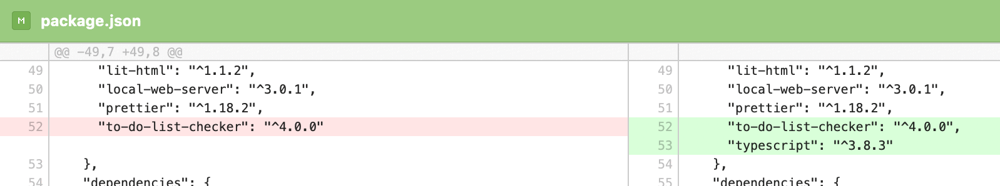
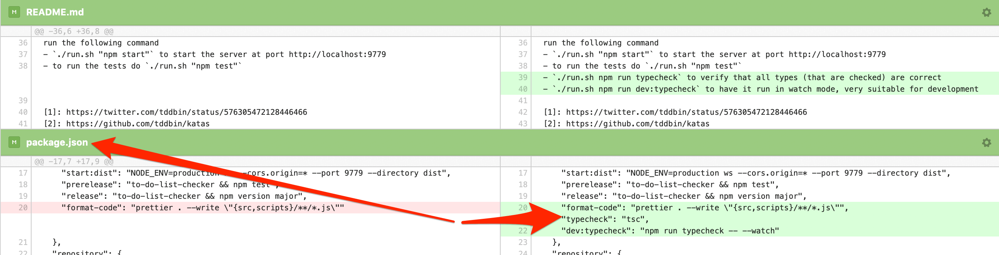
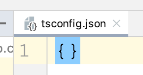
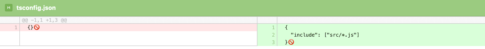
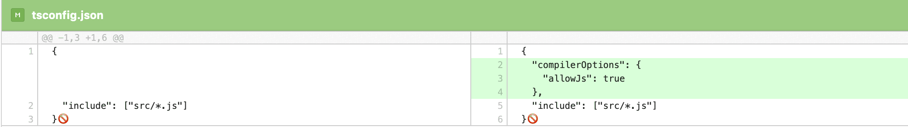
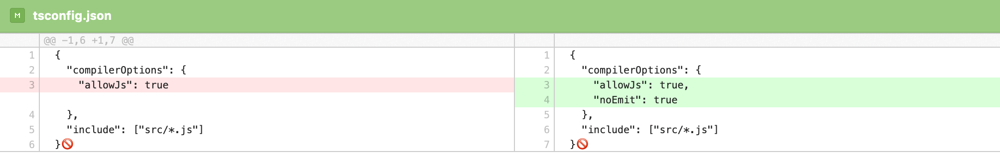
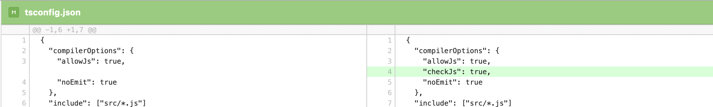
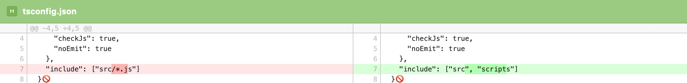

dateCreated: 2020-05-12 18:00 CET  
tags: javascript, typescript, typing, setup, ts4js  
isDraft: true

# TypeScript for JavaScript, Part 1 - Getting Started
You don't need to rename all your ".js" files to ".ts" to go all in on TypeScript, you can go gradually. 
Adopt TypeScript step by step, become familiar with it in your existing JavaScript project.
No need to put development on hold for weeks, while you convert the code base to TypeScript and fix all type errors.
Read on to see how I adopt TypeScript for JavaScript for the project [jskatas.org] sourcecode.

Let's type check JavaScript files by using TypeScript.

## Official Docs are Scarce on this Topic
The TypeScript docs have one page on the topic 
[Type Checking JavaScript Files][1]
but over time, I found out that there is much more to this topic. Thanks to [Jan] and his project [elix] where
[I learned][7] most of the basics on how to apply TypeScript as a type linter on JS files.  

## What is "TypeScript for JavaScript"?
[I used to do a lot of][4] [Flow] to type check my JavaScript code. Meanwhile TypeScript is picking up in features,
though there are major differences in philosophy between Flow and TypeScript.
But TypeScript seems to be the more active project and the one getting more support,
from the community (the [activity on][5] [the projects][6] seems to be on par though). 
Therefore TypeScript currently seems like a very interesting option at this point in time.

So I started to investigate how I can use TypeScript on existing JavaScript projects.
Why not pure TypeScript? The main reason for me was always development speed and a small dependency footprint. 
One way to achieve this is that I try to prevent all build steps and want to run my code straight without 
building and bundling, no matter if I run a browser or nodejs project. 
So depending on the TypeScript compiler to compile my files was not an option for me.

In the following you can see how I **set up TypeScript, as a type linter for JavaScript**, 
to type check JavaScript files.

[jskatas.org]: https://jskatas.org
[Jan]: https://twitter.com/JanMiksovsky
[elix]: https://twitter.com/ElixElements/
[Flow]: https://flow.org/
[deno]: https://deno.land
[1]: https://www.typescriptlang.org/docs/handbook/type-checking-javascript-files.html
[2]: http://www.adamsolove.com/js/flow/type/2016/04/15/flow-exhaustiveness.html
[3]: https://www.typescriptlang.org/docs/handbook/advanced-types.html#exhaustiveness-checking
[4]: https://gitlab.com/wolframkriesing/talk-flow-type-enterjs-2017
[5]: https://github.com/facebook/flow/graphs/commit-activity
[6]: https://github.com/microsoft/TypeScript/graphs/commit-activity
[7]: https://github.com/elix/elix/pull/109#issuecomment-575589440

## Why "TypeScript for JavaScript"?
This allows me to type lint my code optionally. If (for whatever reason) I don't want type safety, I don't have
to worry about it. With pure TypeScript (.ts files) it is not so easy to opt out (afaik) and .ts files are not useable 
in the browser without preprocessing.

Why should I do it at all, when it is optional?
Any linter is optional too. Discipline and interest are required.
Here are a couple of reasons why I think it is valueable:
* When types get complex, I want a tool to point out mistakes.
* When the domain language forms, I want to name things coherently.
* When the team grows, types are more expressive
* [exhaustivness checks][3] create safety and prevent bugs.
* Typing makes me think about the architecture, even if I type the code afterwards.

## How to start with TypeScript for a JavaScript Project

## Install TypeScript Dependency

https://github.com/wolframkriesing/jskatas.org/commit/d5c714565526cc88feb6612fa0f7b49aae5d1b2d

<figure style="display: inline-block">
    
    <figcaption>The diff in the package.json of installed typescript</figcaption>
</figure>

## Add npm Script for Type Checking

https://github.com/wolframkriesing/jskatas.org/commit/11d1fde4673b9204792212fa7d2c98160ad92dcf

<figure style="display: inline-block">
    
    <figcaption></figcaption>
</figure>

nothing happens yet

```bash
> npm run typecheck

> jskatas.org@2.0.0 typecheck /app
> tsc

Version 3.8.3
Syntax:   tsc [options] [file...]

Examples: tsc hello.ts
          tsc --outFile file.js file.ts
          tsc @args.txt
          tsc --build tsconfig.json
...
```

tsc is not configured

## Add tsconfig.json

https://github.com/wolframkriesing/jskatas.org/commit/2a9bbcd7182295c7074bb1662e915a4af00df71b

<figure style="display: inline-block">
    
    <figcaption></figcaption>
</figure>


```
> npm run typecheck

> jskatas.org@2.0.0 typecheck /app
> tsc

error TS18003: No inputs were found in config file '/app/tsconfig.json'. Specified 'include' paths were '["**/*"]' and 'exclude' paths were '[]'.
```

## Add "include" to tsconfig.json

https://github.com/wolframkriesing/jskatas.org/commit/527c05f5202fdf857c2902427a28de4857fe944c

<figure style="display: inline-block">
    
    <figcaption></figcaption>
</figure>

```
> npm run typecheck

> jskatas.org@2.0.0 typecheck /app
> tsc

error TS18003: No inputs were found in config file '/app/tsconfig.json'. Specified 'include' paths were '["src/*.js"]' and 'exclude' paths were '[]'.
```

## allowJs option

https://github.com/wolframkriesing/jskatas.org/commit/5b24fd2bd522291909fe534f320c74571748e8c4

<figure style="display: inline-block">
    
    <figcaption></figcaption>
</figure>

```
> npm run typecheck

> jskatas.org@2.0.0 typecheck /app
> tsc

error TS5055: Cannot write file '/app/src/config.js' because it would overwrite input file.

error TS5055: Cannot write file '/app/src/env.js' because it would overwrite input file.

error TS5055: Cannot write file '/app/src/kata.js' because it would overwrite input file.

error TS5055: Cannot write file '/app/src/katabundle.js' because it would overwrite input file.

error TS5055: Cannot write file '/app/src/katagroup.js' because it would overwrite input file.

error TS5055: Cannot write file '/app/src/lit-html.js' because it would overwrite input file.

error TS5055: Cannot write file '/app/src/pagedata.js' because it would overwrite input file.

error TS5055: Cannot write file '/app/src/rawmetadata.js' because it would overwrite input file.

error TS5055: Cannot write file '/app/src/rss-feed.js' because it would overwrite input file.


Found 9 errors.

```

## noEmit - dont generate js files, compile=off ;)

https://github.com/wolframkriesing/jskatas.org/commit/65c0ab8c6cfe8c35e347e3a340d76faaf992b247

<figure style="display: inline-block">
    
    <figcaption></figcaption>
</figure>


```
> npm run typecheck

> jskatas.org@2.0.0 typecheck /app
> tsc

```

##

https://github.com/wolframkriesing/jskatas.org/commit/7afb09295f9f66d28510152d4dbb24bc26d726a8

<figure style="display: inline-block">
    
    <figcaption></figcaption>
</figure>

```
> npm run typecheck

> jskatas.org@2.0.0 typecheck /app
> tsc

src/config.js:28:10 - error TS2339: Property 'bundleName' does not exist on type 'BundleConfig'.

28     inst.bundleName = bundleName;
            ~~~~~~~~~~

src/config.js:29:10 - error TS2339: Property 'sourceUrl' does not exist on type 'BundleConfig'.

29     inst.sourceUrl = `${katasUrl}/${bundleName}/__all__.json`;
            ~~~~~~~~~

...

Found 24 errors.

```

## Check src+scripts dir

https://github.com/wolframkriesing/jskatas.org/commit/374985ef6171733eaea7e85db202705770ad0b6a

<figure style="display: inline-block">
    
    <figcaption></figcaption>
</figure>

```
> npm run typecheck

> jskatas.org@2.0.0 typecheck /app
> tsc

...

Found 72 errors.
```