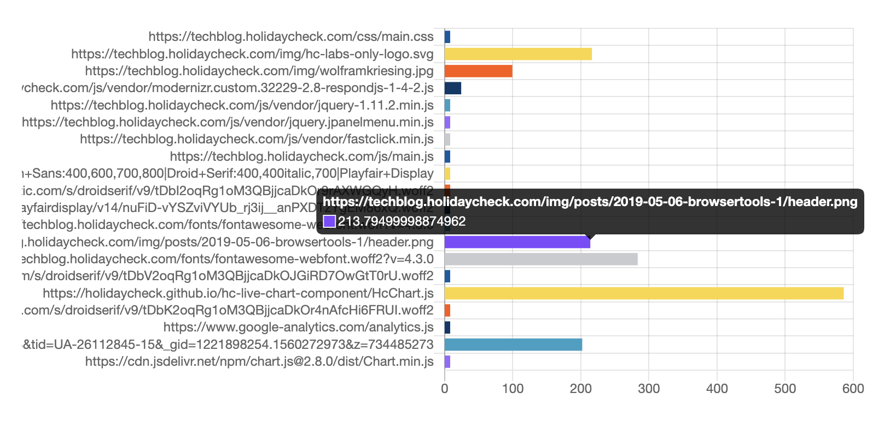

dateCreated: 2020-11-28 14:20 CET
tags: browsertools, knowledgebase, web, site speed, performance
previewImage: header.png

# Resource Timing (part 1) - The API

I want to explore the Resource Timing API, one of the Performance APIs, accessible via `window.performance` 
in all modern browsers.  
This post is the start of a series of [blog posts about browser tools][tag-browsertools], in which I look into any
kind of tools or APIs in and around the browser, things web developers will hopefully find useful.

[tag-browsertools]: /blog/tag/browsertools/

## First Live Stats
Up to here **this page loaded <span id="num-assets-loaded-1">??</span> assets** (or resources) and 
**took <span id="time-taken-loading-1">??</span> seconds to load**. 
<a href="javascript:__updateInlineStats__(1)">Click here to update the stats</a> and the numbers will most probably change.
<span id="loading-failed-hint-1"><em>(If you just see "??" then reading the data didn't 
work, do you have an older browser? You can keep reading and try if and how the described API works in your browser.)</em></span>
Did you click already? Do it!
Why did the numbers change? Because the data you saw first were the data gathered
at the point in time when the rendering of this page had reached here (the page had not been rendered completely, yet). 
When you clicked the link, the page had long been rendered completely.
If you click again to update the stats, the numbers will probably NOT change, because the page had
been loaded completely when you first clicked the link, no new assets/resources have been loaded on the site since.

<script type="text/javascript">
const getMaxResponseEnd = (resources) => {
  return resources.map(r => r.responseEnd).reduce((a, b) => Math.max(a, b));
};

const __updateInlineStats__ = (index) => {
  try {
    const r = window.performance.getEntriesByType('resource');
    document.querySelector(`#num-assets-loaded-${index}`).textContent = r.length;
    document.querySelector(`#time-taken-loading-${index}`).textContent = (getMaxResponseEnd(r) / 1000).toFixed(2);
    document.querySelector(`#loading-failed-hint-${index}`).remove();
  } catch (e) { /* swallow errors */ }
};
__updateInlineStats__(1);
</script>

## What is the Resource Timing API?
These tiny statistics were gathered via the Resource Timing API. 
At the end of this article you get the same stats with the data collected at that point in time of rendering this site,
so you can compare it to the above. The values will most probably differ. Why? The rendering progress of this page
had been at yet another level of completion, more done than at the beginning of this paragraph, but not yet done either.

The Resource Timing API [as describe on MDN][2] and in more detail [in the spec][4], is one of the 
[Performance][1] [APIs][5].
The Resource Timing is focusing on the ["downloadable resources"][11], I would rather say
it focuses on the resources (or assets) that a page loads.
It records detailed timings of the resources loaded. In the data you can see the time when
a resource was started to load, how long it actually took to "fly" from the server to the client, and a lot more.

The function to get the  timings of all resources loaded until the point in time of the function call,
is `window.performance.getEntriesByType('resource')`,
which returns an array of objects that implement the `PerformanceResourceTiming` interface, basically a collection
of properties.
The [spec describes it like this][11]:

> The `PerformanceResourceTiming` interface facilitates timing measurement of downloadable resources.

The `PerformanceResourceTiming` is a specialized interface that extends the `PerformanceEntry`.
Which shows there is quite a lot more and a well thought through structure behind.
If this sounds confusing hang on and read on, the names make sense over time.
Just remember: "Resource Timing" is a "Performance API".

Anyways, the [spec describes `PerformanceResourceTiming` in a quite understandable way][3], I think:

> [The spec] introduces the `PerformanceResourceTiming` interface to allow JavaScript mechanisms to collect complete 
> timing information related to resources on a [website].

The interface that the spec defines is called **"PerformanceResourceTiming", a collection 
of attributes about one resource that a website loads**. For example the attribute `duration` is the time
it took to load a certain resource. 

## Use the Resource Timing API
To get all attributes we have to get all entries of the type "resource", loaded by this site. 
The API call for this is:

```js
window.performance.getEntriesByType('resource')
```

This returns an array of all resources, among which it has attributes `name`, `duration`, `startTime` and `responseEnd`:

```js
[{
    // ... shortened
    name: "https://picostitch.com/_global.css",
    duration: 14.79000000108499,
    startTime: 65.99000000278465,
    responseEnd: 84.66500000213273,
    // ... shortened
}, {...}]
```

The `duration` is given in milliseconds. The time is measured using the DOMHighResTimestamp API, which allows for 
very exact time measuring. 

## Measuring using DOMHighResTimestamp
Why is this needed? We could have used `Date.now()`, but [the spec][7] says it "does not 
allow for sub-millisecond resolution and is subject to system clock skew". Measuring the timings very exact
can make quite a difference with the high speed connections and always improving browser speeds.
You can see the sub-milliseconds part in the `duration`'s value above. 
Good to know that we have reliable time measuring in the browser 
available, details might become another blog post in this series.

## Query the Data
The `name` is the URL of the resource the website loaded and the API measured the resource timing for.
Let me sum up, by looking at the part of the API seen so far.
In the following I wrote two lines of JavaScript to extract `name` and `duration`,
so we can see which resource/URL (`name`) took how long to load (`duration`).
You can try it out on the console of your
browser and see what kind of results you are getting. Feel free to copy line by line.

```js
> // Read all resource that our website has loaded.
> const resources = window.performance.getEntriesByType('resource');

> // Filter out the name and the duration. 
> const durations = resources.map(({name, duration}) => ({name, duration}));

> durations // Print out the contents of `durations`.
```

```js
[  
    // ... shortened
    {name: "https://picostitch.com/blog/blog.css", duration: 18.619999988004565},
    {name: "https://picostitch.com/blog/2020/11/28-resource-timing-part1/fallback-chart-1.png", duration: 51.56999998143874},
    {name: "https://picostitch.com/_global.css", duration: 23.9000000001397},
    {name: "https://picostitch.com/_nav.css", duration: 27.08499997970648},
    // ...
]
```

Looking at the output of an array is fun for developers, but seeing that data in a diagram offers
a different perspective, so let's see the `duration` of all the resources loaded on this website, in a diagram.
Try it: reload the page and see the bars update. This is life data.  
Try also hard reloading the page (mostly done with pressing <kbd>Shift</kbd> additionally to your reload shortcut or click), 
so that caches are not used and the durations will be very different again.

<figure>
  <hc-chart id="duration-chart" style="height: 15rem;">
    
  </hc-chart>
  <figcaption style="padding-top: 2rem">The chart shows the durations it took to load the resources gathered using the Performance API.</figcaption>
</figure>

<script type="text/javascript">
  window.__runOnloaded__ = [];
  window.__runOnloaded__.push(() => {
    const onLoaded = () => {
      window.customElements.whenDefined('hc-chart').then(() => {
        const chart = document.querySelector('#duration-chart');
        const resources = window.performance.getEntriesByType('resource');
        const durations = resources.map(({name, duration}) => ({label: name, value: duration}));
        chart.updateChartData(durations);
      });
    };
    const scriptTag = document.createElement('script');
    scriptTag.onload = onLoaded;
    scriptTag.setAttribute('type', 'text/javascript');
    scriptTag.setAttribute('src', 'https://holidaycheck.github.io/hc-live-chart-component/HcChart.js');
    document.head.insertBefore(scriptTag, document.head.childNodes[0]);
  });
</script>

## `startTime` and `responseEnd` Attributes
The `duration` attribute, is the result of [subtracting][8] the `responseEnd - startTime` attribute.
The `startTime` attribute is the time when fetching the [resource started][9]. The `responseEnd` is the timestamp 
when the last byte was received or [when the transport connection closes][10].

Let's see how to find out how long loading all resources took.
The code you will see now, is the same that generated the stats at the beginning of this article
and as you will find them at the end again, so you can compare the two.
The time taken how long loading all resources took I calculate by 
retreiving all `responseEnd` values and taking the biggest one, as you can see below:

```js
> // Helper function to find the max value in an array.
> const findMax = values => values.reduce((a, b) => Math.max(a, b));

> // Read all resource entries.
> const resources = window.performance.getEntriesByType('resource');

> // Filter out the `responseEnd` attribute and find the maximum.
> const allEnds = resources.map(r => r.responseEnd);
> resources.length + ' resources, ' + findMax(allEnds) + ' ms'
```
<pre id="inline-stats-result" class="highlight">
  If you see this either JavaScript is disabled, or something went wrong :(.
</pre>

<script type="text/javascript">
  window.__runOnloaded__.push(() => {
    const resources = window.performance.getEntriesByType('resource');
    const resourcesStr = resources.length + ' resources, ';
    const timeStr = getMaxResponseEnd(resources) + ' ms';
    document.querySelector('#inline-stats-result').innerHTML = resourcesStr + timeStr;
  });
</script>

Try out: If you reload this page, the numbers will change, look closely at the duration (the second number).

## Live Stats Again

Now that you got here. Let's pick up the live stats again, as seen at the beginning and list the tiny statistics again. 
After the [event "load"][6] (the whole page has loaded, including all dependent resources such as stylesheets images) 
this **page loaded <span id="num-assets-loaded-2">??</span> assets** (or resources) and 
**took <span id="time-taken-loading-2">??</span> seconds to load**. 
<span id="loading-failed-hint-2">(If you just see "??" then reading the data didn't work, do you have an old browser?)</span>
<a href="javascript:__updateInlineStats__(2)">Click here to update the stats</a>, just like above.

<script type="text/javascript">
  window.__runOnloaded__.push(() => __updateInlineStats__(2));
  window.addEventListener('load',() => window.__runOnloaded__.forEach(fn => fn()));
</script>

## Finally

Hopefully this article shows that getting insights into resource timing of a site is not
only possible in your browser's developer tools, but also right in the browser itself. 
What you can do with it I leave up to your imagination.
If you have something interesting please [ping me on twitter][@wolframkriesing], I am curious to see and learn more about it,
especially about useful applications with it.

Soon: You want to know more? Read [part 2 of this series about "Loading Dependencies"].

*The first version of this post I wrote and published [for the HolidayCheck TechBlog, May 2019](https://techblog.holidaycheck.com/post/2019/05/06/browsertools-1-resource-timing-part1).*

[1]: https://developer.mozilla.org/en-US/docs/Web/API/Performance
[2]: https://developer.mozilla.org/en-US/docs/Web/API/Resource_Timing_API
[3]: https://www.w3.org/TR/resource-timing-2/#introduction
[4]: https://www.w3.org/TR/2017/CR-resource-timing-1-20170330/
[5]: https://www.w3.org/TR/performance-timeline-2/
[6]: https://developer.mozilla.org/en-US/docs/Web/API/Window/load_event
[7]: https://www.w3.org/TR/hr-time-2/#abstract
[8]: https://www.w3.org/TR/2017/CR-resource-timing-1-20170330/#performanceresourcetiming
[9]: https://developer.mozilla.org/en-US/docs/Web/API/PerformanceEntry/startTime
[10]: https://developer.mozilla.org/en-US/docs/Web/API/PerformanceResourceTiming/responseEnd
[11]: https://www.w3.org/TR/resource-timing-2/#sec-resource-timing
[@wolframkriesing]: https://twitter.com/wolframkriesing