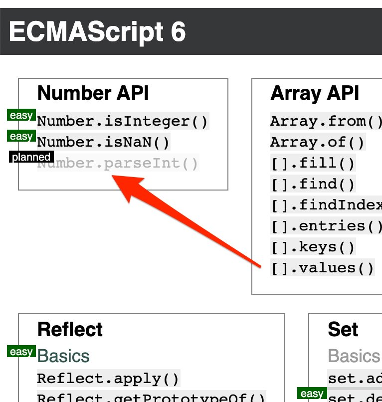
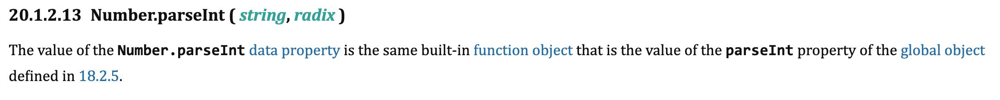
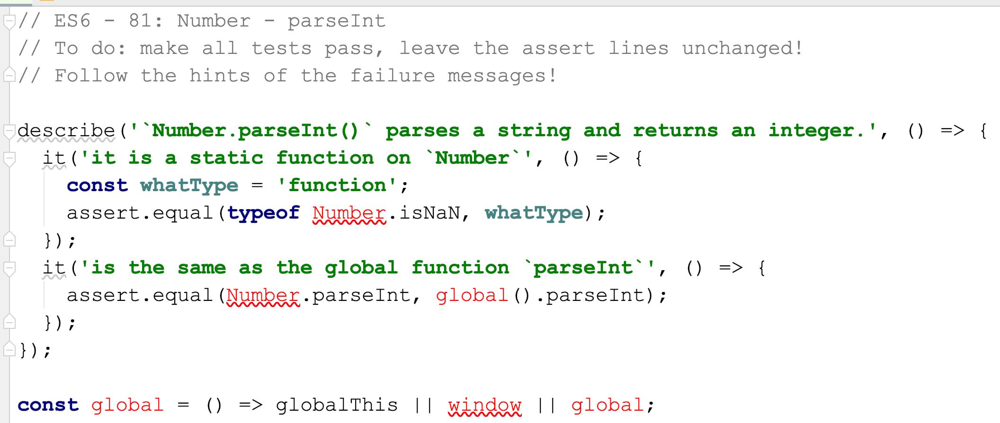
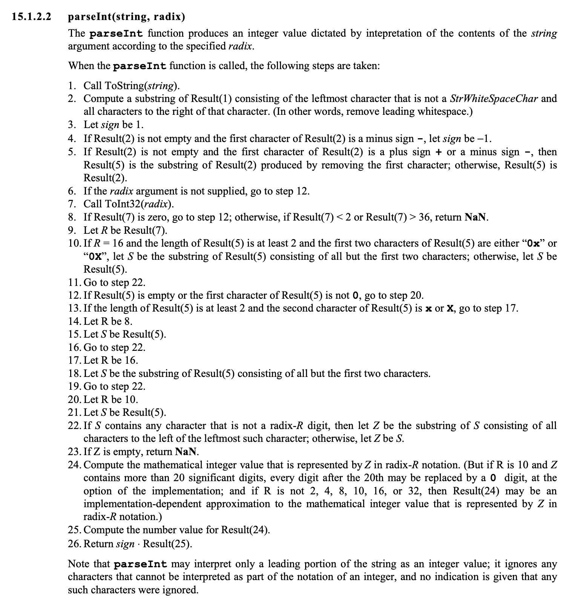
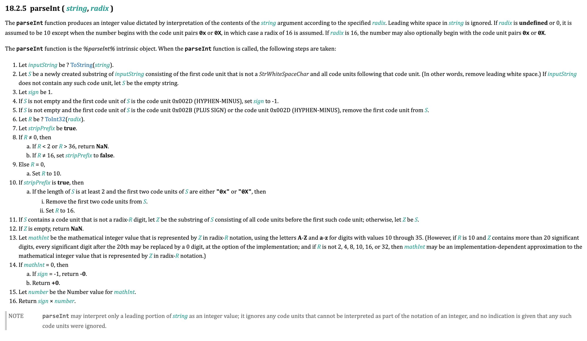
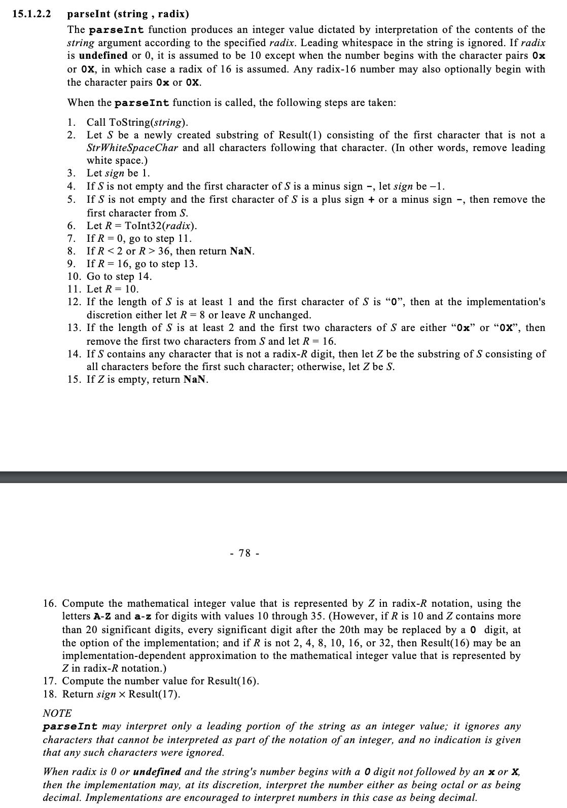
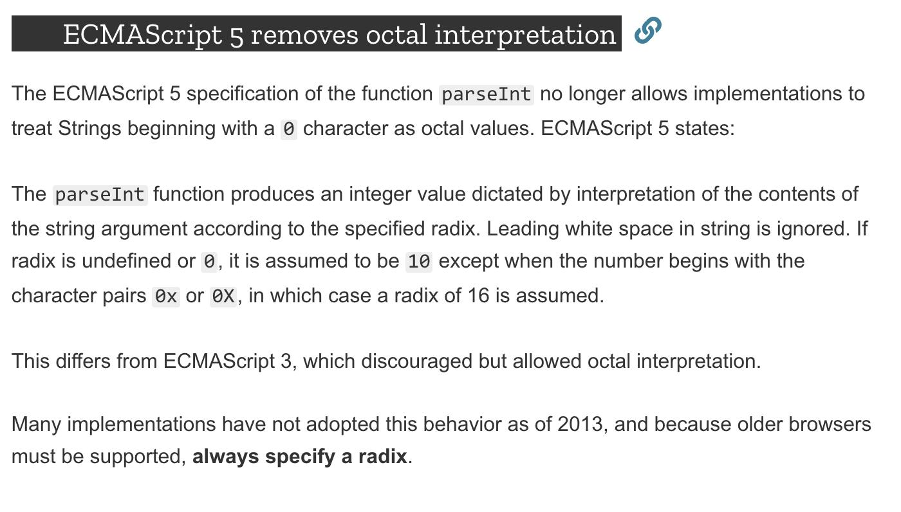
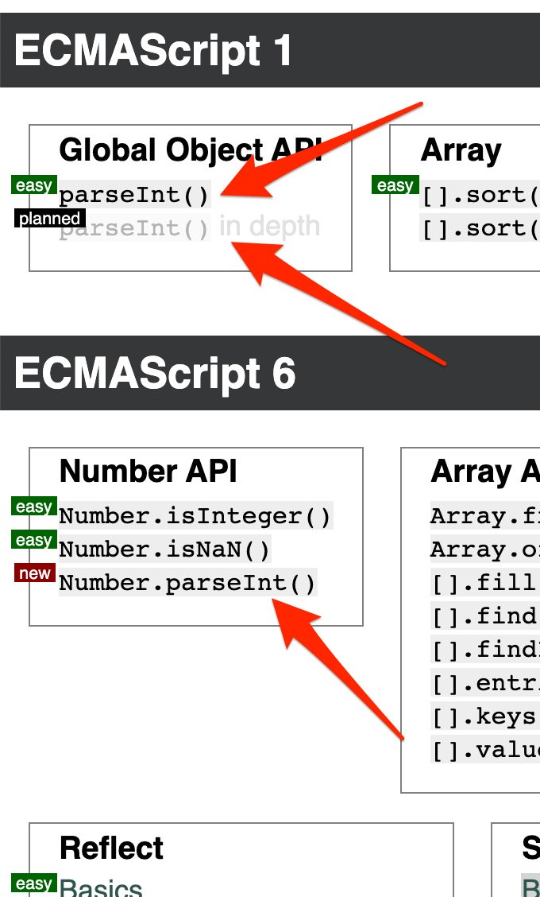

dateCreated: 2021-01-11 21:58 CET
tags: kata, Number, parseInt, ES1, ES3, ES5, ES6
previewImage: preview.jpg
canonicalUrl: https://blog.jskatas.org/blog/2021/01/11-building-the-parseint-kata/
canonicalHint: Originally posted on the JSKatas Blog

# Building the `parseInt()` Katas

I had planned building the kata for `Number.parseInt()` already a while ago.
Starting to work I discovered very quickly that this seemingly tiny kata is quite a 
rabbit hole that offers a lot of things one can learn.
Especially about how things evolve in the spec and how to read the spec, fortunately
this is a pretty easy to read part of the spec.

<figure>
    
    <figcaption>The kata is in the planning.</figcaption>
</figure>

## Content

1. [`Number.parseInt()` and the Global `parseInt()`](#numberparseint-and-the-global-parseint)  
1. [ES1: `parseInt()`](#es1-parseint)
1. [Diff Between ES1 and ES6](#diff-between-es1-and-es6)
1. [ES5 Introduced one Change](#es5-introduced-one-change)
1. [Katas Done](#katas-done)
1. [Conclusion](#conclusion)

## `Number.parseInt()` and the Global `parseInt()`

Actually ES6 makes the `Number.parseInt()` kata very simple. 
Because it just says it's the same as the global `parseInt`.
Reading the spec it seems this is a simple piece of JavaScript.
The kata should be easy to build. It builds on the existing global `parseInt`
function, so what is there left to learn for `Number.parseInt()`? Can I not just simply
link to the ES1 kata for `parseInt`?

<figure>
    
    <figcaption>The Number.parseInt spec text.</figcaption>
</figure>

In the ES6 kata I currently just plan to have two tests (see image below). 
And I am thinking of adding a third one that just says "look into the ES1 kata for the global `parseInt`".
And this is where it gets a bit difficult.

<figure>
    
    <figcaption>To begin with, two tests in this kata.</figcaption>
</figure>

## ES1: `parseInt()`

I looked up [the spec archive](https://www.ecma-international.org/publications/standards/Ecma-262-arch.htm) 
and [in ES1 `parseInt` was already specified](https://www.ecma-international.org/publications/files/ECMA-ST-ARCH/ECMA-262,%201st%20edition,%20June%201997.pdf) 
(see image below). 
But the content in the ES6 spec is quite different (see 2nd image below).
The ES1 spec has a list of 26 items defining the global `parseInt()` function, ES6 only 16.

<figure>
    
    <figcaption>The ES1 spec text for parseInt.</figcaption>
</figure>
<figure>
    
    <figcaption>The ES6 spec text for parseInt, different to ES1.</figcaption>
</figure>

The change is interesting, since I was always under the assumption that JavaScript
only gets extended and never (or only very rarely) changed, so that it stays backwards 
compatible all the time.

## Diff Between ES1 and ES6

Now, I have to decide how to continue for building the kata.
I had two choices:
1) figure out when it changed, between ES1 and ES6, or
2) read the spec texts carefully and figure out if it matters for my kata.

I went with 1), since I am too lazy for 2) and doubt I get it done this year.

The `parseInt` spec text changed significantly [in ES3](https://www.ecma-international.org/publications/files/ECMA-ST-ARCH/ECMA-262,%203rd%20edition,%20December%201999.pdf). 
It is still not the same as [in ES6](https://www.ecma-international.org/ecma-262/6.0/index.html#sec-parseint-string-radix) 
and also different to [ES10](https://www.ecma-international.org/ecma-262/10.0/index.html#sec-parseint-string-radix).

<figure>
    
    <figcaption>The ES3 spec of parseInt.</figcaption>
</figure>

The original question I wanted to answer was: In which category does the kata for `parseInt` belong? 
Into "ES1" or somewhere else?
I guess the answer is I put it into ES1 but will use the latest spec to write the kata, 
and assume the functionality has not changed (significantly).

In case I ever figure out that the functionality of `parseInt` has changed between ES1 and ES10, 
I would have to come back and split the `parseInt` kata and move the changes into the according ESx kata.

## ES5 Introduced one Change

One thing [changed with ES5 about how `parseInt` works](https://developer.mozilla.org/en-US/docs/Web/JavaScript/Reference/Global_Objects/parseInt#ECMAScript_5_removes_octal_interpretation). 
"ECMAScript 5 removes octal interpretation" - I am glad this has changed, it did bite me hard once.
See below for the entire explanation from MDN. 
So good to read this, and also to read the hint **"always specify a radix"**.

<figure>
    
    <figcaption>ECMAScript 5 removes octal interpretation</figcaption>
</figure>

## Katas Done

So I finished two new katas for `parseInt`. 
One [the ES6 version](https://jskatas.org/#bundle-es6-katas), 
the other in [ES1](https://jskatas.org/#bundle-es1-katas) 
and the in-depth one is just a draft. 
[PR is ready](https://github.com/tddbin/katas/pull/80). 
Input welcome.

Here is what it looks like currently, on my local system, and is probably already merged at the time you are reading this.

<figure>
    
    <figcaption>The ES1 and ES6 katas.</figcaption>
</figure>

It is live.
The ES1 `parseInt()` kata is live, now. The in-depth one will follow.
https://jskatas.org

## Conclusion

I would sum up my learning like this: 
* read the spec, 
* get your hands dirty, 
* investigate the roots, 
* you will always learn something along the way. 

The best part, is that you never know when the different dots of your knowledge connect.
Stay hungry, keep learning.

Find the original [thread on twitter](https://twitter.com/wolframkriesing/status/1180533105221873672) 
where I had first collected some info for this blog post.