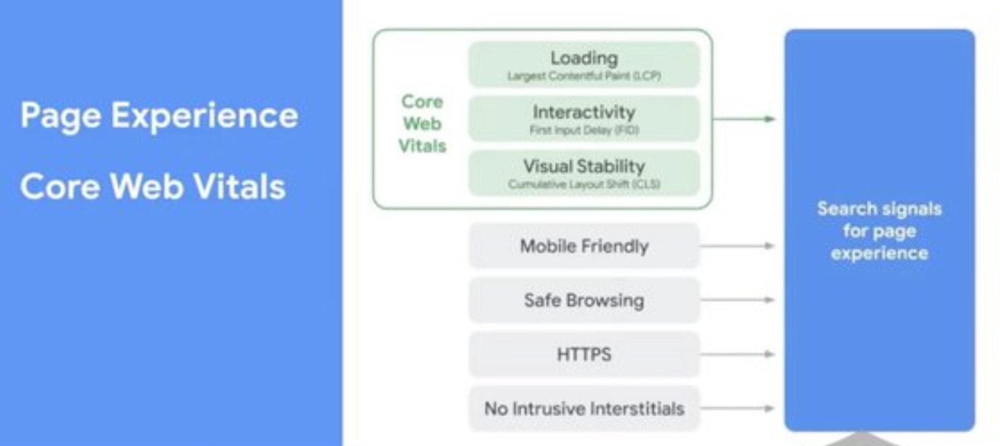

dateCreated: 2021-01-29 16:20 CET  
tags: conference, JavaScript, a11y   
previewImage: preview.png  

# TestJSSummit - Notes for Day 2

After live [blogging on day 1](/blog/2021/01/28-testjssummit-day1/) 
I made a plan for day 2.
I will watch all content in 2x speed and just pause whenever I need a bit to
write. It's just a video, so I can catch up by higher speed.
Also I came to the conclusion that I don't even need to be fully in sync,
except for the polls and the live chatting, but there is too much life
going on in parallel that I am glad about the pause button.

I still don't get why my (intended) joke from yesterday didn't catch on. hehe

<blockquote class="twitter-tweet" data-partner="tweetdeck">
<p lang="en" dir="ltr">Live watching 
<a href="https://twitter.com/hashtag/TestJSSummit?src=hash&amp;ref_src=twsrc%5Etfw">#TestJSSummit</a><br><br>Set 2x speed in the youtube player =&gt; maybe advances (me in) time. <a href="https://twitter.com/hashtag/mindblown?src=hash&amp;ref_src=twsrc%5Etfw">#mindblown</a> <br><br>Didn’t work :(
</p>&mdash; @wolframkriesing 
<a href="https://twitter.com/wolframkriesing/status/1354871280818917377?ref_src=twsrc%5Etfw">January 28, 2021</a>
</blockquote>

After day 1 I have to say I am not that amazed. It is a lot about tooling and
showing products.
Anyways, let's dive right into day 2.

## Talk 1: The Cypress Talk

[Gleb Bahmutov](https://twitter.com/bahmutov)
starts taking apart how he categorizes tests. 
What kind of tests he suggests to use for what kind of part of an application.
They are tied to technical boundaries.
For example testing a server backend he suggests to use API tests,
for "individual piece of code" he suggests a unit test, and so on.
In the end he is advertising that cypress will have a node test runner.
I think I get it, this is how cypress "sees" the kinds of tests. Maybe
I didn't listen properly in the beginning :).

Next he suggests that certain kinds of tests (written using cypress)
is "too short" he says, "this is unproductive". The tests are testing a single
DOM element's attribute each. I would not say they are too short, these
are just the wrong kinds of tests. Testing DOM elements' attributes'
values is not very often useful. As usual, it depends. [I did that too][testing-dom-attributes].
Though I am not sure if putting all assertions into one test is the better
strategy, this will result in not knowing why a test failed. Maybe another
indication for the wrong kind of test?

Confirming my above assumption, he says too long tests make you unproductive,
but I am not sure I can agree to the reasons, like "the longer the test 
the higher the chance the browser will run out of memory and crash". What?
I am not sure I want this kind of web application. Does this imply that cypress
causes those memory overflows? I mean browsers are kept open on websites for ages
nowadays, right?
Also, the argument that shorter tests allow for faster problem detection, is what
I tried to say above too.

As usual, it depends. I think long tests are sometimes very useful. For example
I prefer just a handful of tests to ensure the critical paths of my site/app
work and people can do the most important things. They can take long and give
me safety and are easy to maintain, because there are few of them.

A cypress assertion might be like `should('not.be.visible')`? String?
Mmmh, that is what I am always struggling with with the expect-kind approach
of writeing assertions. Have a look at [hamjest] an assertion library that allows
you to write very expressive assertion, that are readable, auto-complete and
output well readable, useful errors.

He brings forward really good arguments for good documentation.
Oh yeah, good docs makes life easier. Not only for the users, also for the maintainers.
Gleb even looks for searches on the docs page that return no results and writes
docs for it. Pretty cool!  
Cypress team has a tool that parses markdown files and runs the examples that are in there,
just like http://fitnesse.org does.  
Promote your own docs, as he does. This is pretty cool, forces you to improve them
but also focuses on usability! Kudos!!!

Mmmh, in the Q&As Gleb mentions the "big test" for testing a user journey,
like an entire shopping experience, as a good test. I agree. So I guess how I understood
his arguments about big tests being unproductive,
in the beginning, is just not to be understood as the absolute. As usual, it depends.

## Talk 2: Playwright

There is pupeteer out there, but now there is [Playwright](https://playwright.dev), the cross platform
browser automation testing tool, headless as far as I know.
It is not like selenium but rather like a virtual user
using the browser, by interacting via the native interfaces, I think.  
This was my 2 cents, before the talk starts. Now off to listen to 
[Arjun Attam](https://twitter.com/arjunattam) from
Microsoft talking about Playwright.

He touches on new features coming to the web continuously. I am curious how
he gonna show that Playwright will be catching up fast with those.

I like this example, it shows well what plywright is good at and made for:
```js
const {chromium, firefox, webkit} = require('playwright');
```
Ok, the `require` is old-style, but it shows well that playwright is for automating all
browsers. Yeah!
Oh, and "Playwright webkit is available across all platforms [...] you can use webkit
to test for your Safari issues in your Linux CI environment". Isn't that cool?
* Playwright can run in headless and headful mode.
* it can emulate devices, like an iPhone 11
* it can tell the browser to have certain permissions turned on (e.g. geolocation, notifications, ...)
* you can set color scheme to dark,
* you can set the browser "to be" in a certain geo location (giving lat+lng)
* set a locale
* mock certain URLs
* listen to events such as console calls, domcontentloaded, websocket connections, ...
* ...

All this is just not possible with tools that run inside the browser.
I love it. This is the right way, I think.

Very important is what he says about how interactions on the page are handled,
e.g. the code:
```js
await page.goto('irrelevent-url');
await page.click('a-selector');
```
he says that playwright prevents the use for waiting and timeouts by automatically 
waiting internally before executing the `page.click` until the element
* is visible,
* is done animating,
* is ready to receive click events.

"All this internally done for you". Cool. Of course you can build the wait conditions yourself too. Good.
Isn't that what cypress is doing under the hood too?
I am curious how much those two are aligned, work together, etc.

In the Q&A Arjun mentions that Playwright will provide a test runner. 🙈
Why? There are enough out there. I am sure users wanted it, that's why they are
doing it but why not invest the time in things that playwright can become better
at than redoing what others do. Why not just document better how to use test runner
X or Y with playwright? I guess they discussed that.
I didn't find the test runner on the website. Mmmh.

## Talk 3: Detox (Mobile end-to-end test for apps)

[Rotem Mizrachi-Meidan](https://twitter.com/rotemmiz)
says they started [detox](https://github.com/wix/Detox) 
for testing their React Native app.
Oh, this sounds like I need this at my current job. We have it set up, but until
now we didn't have time to catch up and tbh I was also a bit reluctant to use
such a (seemingly) heavy tool. I only heard about installation problems until now ;).
Let's see how well Rotem will sell it (to me).

Detox only "acts" when there is nothing more to do, no network requests, no animation,
the app has nothing to do he says. Mmmh, that sounds clever.

"Our test are easy to run and they are cheap to run." He says after he has explained
the imho complex and big architecture of their Wix app. I am really curious how
those two go together.

"Detox doesn't have any screenshot comparison mechanisms. It can take device-level screenshots
and element-level screenshots, to compare them with external apps." That is one piece
of information I was looking for. Thanks for sharing Rotem!
They use aplitools to compare the screenshots, to prevent the slight pixel diffs.
Sounds clever.

He later touches on mobile CI and mentions that they tried all the tools.
He says that the problem is always android emulators, which he states run
better on Mac than on Linux. This is news to me. I have not experienced that yet.
They have an internal CI on VMWare with real Macs.
Oho, compilation times are slow. Yep, I know what you talk about.
Mac Minis he says they reached 2x compile speed.
Oh, I misinterpreted, he is of course talking about running the detox tests on those machines.
Yep, I can imagine this to be fun (not).
Their QA engineers are faster than running their tests on servers. Oho.

And the talk is over. Surprise.

Afterwards the poll actually offers me the list of (all the) mobile test automation tools.
There is: Appium-based, Detox, Espresso and XCUITest.

Oh, in the Q&A when Rotem was asked about device features like camera, turning the device on/off,
going offline, etc.
he says that detox runs on simulators, not on real devices yet (on iOS).
But they seem to be working on that on iOS.
Faking/mocking network stuff is nothing they can solve and do yet.
Camera just works, there is nothing that blocks it, he says. Not sure what that means.
He mentions that he has just written 
[this blog post "Detox: Writing Stable Test Suites"](https://medium.com/wix-engineering/detox-writing-stable-test-suites-372c9d537184).

## Talk 4: A11y

[Ava Wroten](https://www.wroten.me/) 
starts by saying that in her talk she will be using a lot of emberjs, the
framework she works with mostly. Very interesting, I used to do quite some ember
a while ago, we did not become best friends. I remember it shipping yet one more npm
with it. That made me very suspicious. But I have heard things have improved.

> People with disabilities are the worlds largest minority

Well said. Emberjs has first class a11y support. That is cool. Reminds me
of dojo, it had also brought this from the beginning all the time.
Yep, if there are pitfalls in the framework they bubble up all the way 
into every app using this framework, she says.

So many good hints, I will fallback to listing the tools she mentioned and examples she listed, 
which often make it clear what the tool does:
- [axe-core](https://github.com/dequelabs/axe-core) 
- https://www.deque.com/axe/ has browser extensions
- axe support is built into Svelte 🎉
- @axe-core/react, `axe(React, ReactDOM, 1000)`
- vue-axe, `Vue.use(VueAxe)`
- jest-axe, `exepct(await axe(html)).toHaveNoViolations()`
- @axe-core/webdriverjs
- cypress-axe, `cy.injectAxe(); cy.checkA11y()`

Good tip, is that a11y testing will always involve some manual testing.
And it is never complete without manual testing an app or site.
Automation is not getting it all.

Great request at the end:

> Hire someone different than you.

Thanks a lot Ava!

## Talk 5: Site Speed

[Martin Splitt](https://twitter.com/g33konaut)
is talking about website speed. He always brings a lot of insights
directly from where google builds their tools, he knows that stuff.
It is always worth watching him and his talks, they are very insightful.
Since it was a topic I had been deeply involved and working with over the last
years I don't expect much new. 
Let's see.

He mentions one thing that I remember I also had to fight for
"lab vs. real user metrics". Make sure to measure both!

**Core Web Vitals** is what Google calls their new approach to measuring this
speed stuff. I am not sure we are getting anywhere by changing the approach every year :).

> Metrics will be updated ~yearly

Hehe.
Which ones are these vitals?
1) **LCP - Largest Contentful Paint**, good <2.5sec, poor >4sec
   specifies when the main content is likely visible
2) **FID - First Input Delay**, good <100ms, poor >300ms
   how fast the page responds to user inputs
3) **CLS - Cumulative Layout Shift**, good <0.1, poor >0.25
   (the unit is roughly percent of change on the visible are of the page)
   how much of the layout is shifting unexpectedly
   (sounds like a good measurement for the evil ads)
   
Actually this seems like a well thought through set of numbers, esp. CLS since it
takes into account where and therefore how much of the pages change.
But in the Q&A afterwards he already admits the CLS is problematic with SPAs.
So we might get a couple more metrics next year ;).
   
All these factors will start to flow into the ranking factor of google 
starting around May 2021. This chart below shows some of those factors well.
I am sure Google won't show us all of them.

<figure>
    
    <figcaption>Google Ranking Factors, starting May 2021</figcaption>
</figure>

Oh wow, and Google will not require AMP sites to show up in their
"awesome", best selling, first on page, fast loading and most visible carousel
at the top of every search result page. This is definitely a good signal for 
fast pages that had not felt the inspiration to use AMP yet, which I support fully.
I am looking fwd to picostitch in these carousels.

Hehe, the poll after his talk states 3rd party JS to have the biggest impact on
the performance of most people's sites.
The 3rd party must be someone's own JavaScript, right? Those people are probably not
watching this conference.

## Talk 6: Beyond API Mocking

After I thought I am not going to write stuff for Martin's talk, I did in the end.
Let me start into blogging about this next talk with a tweet that I was triggered 
to send out by the organizers' poll:

<blockquote class="twitter-tweet" data-partner="tweetdeck">
    <p lang="en" dir="ltr">
        „How do you mock API at work?“<br><br>
        where is the option &quot;dependency injection&quot;?
        <a href="https://twitter.com/hashtag/poll?src=hash&amp;ref_src=twsrc%5Etfw">#poll</a>
        at <a href="https://twitter.com/hashtag/TestJSSummit?src=hash&amp;ref_src=twsrc%5Etfw">#TestJSSummit</a>
    </p>
    &mdash; @wolframkriesing 
    <a href="https://twitter.com/wolframkriesing/status/1355220650059837441?ref_src=twsrc%5Etfw">January 29, 2021</a>
</blockquote>

"Why are we writing tests?". Confidence is his answer. We should follow two principles he says, 1) 
test as a user and 2) establish boundaries.
He sees mocking to distribute these boundaries. I didn't understand that sentence properly. Maybe it will come.
Now he explains 2 mock practices the first 1) mock server and 2) mock client.
He next shows how to mock `fetch`.
Aha, now he is coming and talking about real problems with mocks, the disconnect between the production code
and the mocked code. The solution he suggests is Service Worker. That is a surprise.
This switched from methodoligy to technology. Mmmh. He shows his project "Mock Service Worker".
Somehow I get the impression that Playwright is the right solution here, he is talking about
working in the browser all the time, so scroll up and read what I learned today that Playwright covers.

Oh funny, in the poll results in the end Anna says "What? 24% don't mock their APIs. What?".
I guess "not mocking the API" means different things to different people. I understood this option
to ask if I mock network requests, routes or alike.
Anyway, dependency injection was missing ;).

## Talk 7: Testing, Serverless, Hexagonal Architectures

[Slobodan Stojanovic](https://slobodan.me) 
starts by saying that vendor lock-in is the biggest problem.
He uses some mysterious Jeff that runs cloud services and goes evil at some point. I couldn't stop laughing.
The next guy he moves his servers to is Bill. LOL. Jeff's servers are in yellow, Bill's in blue.
Thanks Slobodan, this is a great good night story!
He renames vendor lock-in to switching costs.
He is now getting to his topic "Writing testable serverless apps and preventing vendor lock-in using
hexagonal architecture". I get a little bit the feeling that this providing the vendor lock-in is
something that either he ran into or feels it will become a problem. Not sure if it is this relevant.
Let's see. A lot of text on the slides. At my 2x speed watching this becomes hard.

> The serverless testing pyramid would look more like a mayan pyramid then an egyptian pyramid.

Nice one.

He shows a function with three arguments that seem to connect to the outside.
Looks like dependency injection to me.
His example of switching from mongo to dynamo is really nice, even if it is nothing that is exclusive
to hexagonal archtiectures it is very important to mention that the DB should never leak into your
business logic.

Ok, this talk was bascially pushing a bit for good architecture, a topic that fell a bit short
at the conference. Testing and good architecture go very much hand in hand.

[testing-dom-attributes]: https://github.com/wolframkriesing/site-stitcher/blob/master/src/render-tidbit/render-page.slow-spec.js#L65
[hamjest]: https://github.com/rluba/hamjest