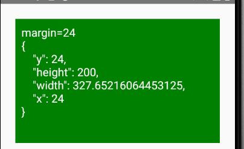

dateCreated: 2021-07-29 11:44 CET  
tags: React Native, JavaScript, android, iOS, mobile, KeyboardAvoidingView  

# Understanding React Native's `onLayout` Attribute (a bit)

The [`<KeyboardAvoidingView>`][1] is one component provided by [react-native], which (magically) handles
the screen to re-layout when the virtual keyboard opens on ones phone.  
This component comes not without challenges, I had actually [written about it][2] and I still keep
finding things, which make me dig deeper into it to understand and eventually (fix and) use it properly.


## Dive in

## Let's talk about `onLayout` first

Multiple components, among them the `<View>` component of react-native have an argument called 
[`onLayout`](https://reactnative.dev/docs/view#onlayout).  
The `<View>` component is used inside the `<KeyboardAvoidingView>` to re-layout the screen when
the screen opens. The `onLayout` callback is used to re-layout ([see the source][3])
when the keyboard opens (or closes).

### When does `onLayout` fire?

While trying to hunt for a certain bug we have in our project, I figured out I need to understand
when `onLayout` fires. I started by passing style parameters to the `<KeyboardAvoidingView>`
which just passes them to a standard react-native `<View>` component, so I can also try it on that
component.

To test if `onLayout` triggers, I created a very simple app, like so:
```javascript
export const App = () => {

    // Generate a value that continuously changes.
    const [changingValue, setChangingValue] = React.useState(0);
    React.useEffect(() => {
        const t = setTimeout(() => { setChangingValue(changingValue > 50 ? 0 : changingValue + 1); }, 200);
        return () => clearTimeout(t);
    }, [changingValue]);

    // Make a change in the `layout` value re-render.
    const [layout, setLayout] = React.useState('');

    const propertyName = 'borderWidth'; // Play with this value, e.g. "padding", "margin", "top", "left", ...
    return (
        <View
            style={{flex: 0, height: 200, backgroundColor: 'green', [propertyName]: changingValue}}
            onLayout={(e) => { setLayout(JSON.stringify(e.nativeEvent.layout, null, 4)) }}
        >
            <TextL style={{color: 'white', padding: 10}}>{layout}</TextL>
        </View>
    );
};
```
[Open in snack.expo.dev](https://snack.expo.dev/vG2AFUaim).

**This app renders some current layout values, provided by `onLayout`, every time `onLayout` fires.**
Playing around with the attributes was definitely very teaching for me.   
Note: I use the background color to also visually see the change of the `<View>`, the edges, borders and its position.

What I learned is, when the following values change `onLayout` fires:
- `margin`
- `left`, `top`, `right`, `bottom`
- `height`, `width`, `maxHeight`, `maxWidth`
- `aspectRatio`

Changing the values of the following props **do NOT** fire `onLayout`:
- `padding`, `padding*`
- `borderWidth`, `border*Width`, `borderRadius`

## `margin` fires `onLayout` - Why?

When I first changed the value of `margin` and saw that this triggers a `onLayout`,
I was surprised. Why would changing a margin change the box size, which I thought
was responsible for triggering `onLayout`? When I started printing the values
of the `LayoutEvent` (provided by `onLayout`'s parameter, via `e.nativeEvent.layout`)
I realized that a margin is rendered by just making the box smaller and repositioning
it absolutely. That makes a lot of sense, instead of artificially doing some layout
magic and adding some "virtual" margin, just to be web-like. Nice.

<figure>
    
    <figcaption>Changing margin attribute</figcaption>
</figure>

## Diving into the react-native code

Reading the react-native source code a bit I found the following:

> Simple test to verify that layout events (onLayout) propagate to JS from native.

[This comment in the code](https://github.com/facebook/react-native/blob/1465c8f3874cdee8c325ab4a4916fda0b3e43bdb/ReactAndroid/src/androidTest/java/com/facebook/react/tests/LayoutEventsTestCase.java#L14)
sounds to me as if all native `onLayout` events are propagated to react-native.
Which means one needs understand when the underlying platform sends layout events.
Good to know.

One more finding, the `onLayout` dispatching seems to be even device dependent (potentially),
because [this Android code in the file "uimanager/ReactShadowNodeImpl.java"](https://github.com/facebook/react-native/blob/1465c8f3874cdee8c325ab4a4916fda0b3e43bdb/ReactAndroid/src/main/java/com/facebook/react/uimanager/ReactShadowNodeImpl.java#L341)
determines when a layout change is detected, which I assume triggers an `onLayout`.
I didn't find the connection from this file to firing `onLayout` but while digging into the
code I somehow (magically) "saw" the connection ;).

This code does also very well reflect the learning from above.
The code:
```java 
int newAbsoluteLeft = Math.round(absoluteX + layoutX);
int newAbsoluteTop = Math.round(absoluteY + layoutY);
```

reveals that intention quite well. The variables `absoluteX` and `absoluteY`
do already, by using "absolute", let me assume
this is how the box's position is calculated and that, when they change, fires the
`onLayout`.

[1]: https://reactnative.dev/docs/keyboardavoidingview
[react-native]: https://reactnative.dev
[2]: /tidbits/2020/12/keyboardavoidingview-the-missing-docs/
[3]: https://github.com/facebook/react-native/blob/1465c8f3874cdee8c325ab4a4916fda0b3e43bdb/Libraries/Components/Keyboard/KeyboardAvoidingView.js#L180
