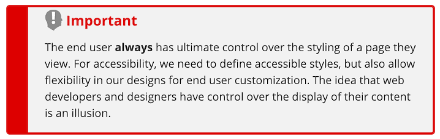
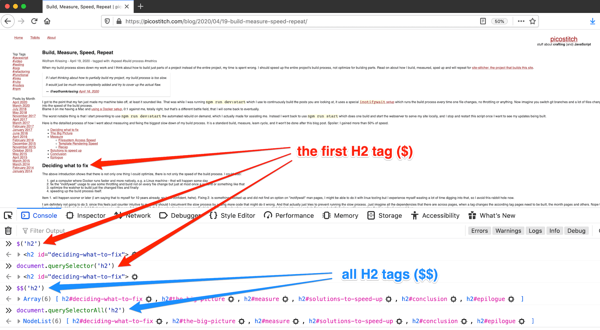

# GitUp v1.1.3 is out

dateCreated: 2020-04-29 22:34 CET  
tags: tools

My favourite git tool GitUp, which allows me to do everything with the keyboard and still has a UI has just received an update
and if I had not read the [release notes](https://github.com/git-up/GitUp/releases) I wouldn't have known that now
the "Fix double clicking title not expanding window" landed.
I had already trained my muscle memory and would probably not have realized.

Read your tools' release notes and changelogs, they make you more productive!
Learned it from [JB](https://twitter.com/jbrains).

# HTML Design Principles

dateCreated: 2020-04-29 17:45 CET  
tags: html

There is nothing new about websites being backwards compatible. The HMTL Design Principles from the W3C are from
November 2007 and they are not outdated!

For example on graceful degradation:

> On the World Wide Web, authors are often reluctant to use new language features that cause problems in older user agents, or that do not provide some sort of graceful fallback. HTML 5 document conformance requirements should be designed so that Web content can degrade gracefully in older or less capable user agents, even when making use of new elements, attributes, APIs and content models.

A nice hack for making shiny stuff not show up on older user agents:

> The default presentation of the proposed irrelevant attribute can be emulated through the CSS rule `[irrelevant] { display: none; }`.

Any tag that might be misunderstood by newer browsers or would just be useless add the attribute `irrelevant` like so `<div irrelevant>This content is not necessary and can only be shown by modern user agents.</div>`

https://www.w3.org/TR/html-design-principles/#degrade-gracefully

# Developer Experience over User Experience - Ouch

dateCreated: 2020-04-29 17:35 CET  
tags: tools  

Jeremy Keith nailed it again:

> But as a general principle, I think this works:
>    User experience, even over developer experience.
> Sadly, I think the current state of “modern” web development reverses that principle.

another one

> user has to pay when developers choose to use megabytes of JavaScript

[Read "Principles and priorities" on his blog adactio.com ...](https://adactio.com/journal/16811)

# The End User Always has Ultimate Control

dateCreated: 2020-04-29 17:11 CET  
tags: a11y

While hunting for accessibility resources, especially the reasons why designs need to be flexible
I came across this article [Accessible CSS](https://webaim.org/techniques/css/) on [WebAIM.org](https://WebAIM.org).
And their warning sign just needs to be shown around the web even more.

<figure>
    
    <figcaption>Warning that the user has ultimate control</figcaption>
</figure>

[Read "Accessible CSS" on WebAIM.org ...](https://webaim.org/techniques/css/)

# Install Chromium (or a Package that needs it) inside Docker

dateCreated: 2020-04-27 12:52 CET  
tags: docker

I found a couple hints, but this one might be the best one.
https://github.com/puppeteer/puppeteer/blob/master/docs/troubleshooting.md#running-puppeteer-in-docker
I actually changed parts

```
RUN npm i puppeteer \
    # Add user so we don't need --no-sandbox.
    # same layer as npm install to keep re-chowned files from using up several hundred MBs more space
    && groupadd -r pptruser && useradd -r -g pptruser -G audio,video pptruser \
```

I replaced with

```
RUN mkdir /app/node_modules
RUN groupadd -r pptruser && useradd -r -g pptruser -G audio,video pptruser \
```

So that I let `npm install` install the package that has Chromium as a dependency (it might not be puppeteer itself).

Also I had to replace 
```
     && chown -R pptruser:pptruser /node_modules
```

by

```
     && chown -R pptruser:pptruser /app/node_modules
```

since my `WORKDIR=/app` so `node_modules` will be inside that directory.
Works well.

# Find and Execute Command with Found Files

dateCreated: 2020-04-27 00:16 CET  
tags: linux

You need to 
1. Find files and
2. Execute a command with each found file

This is how it works:\
`find . -name '*.jpg' -exec cp '{}' ../_output'{}' \;`

The command finds all `*.jpg`s via `find . -name '*.jpg'`.
Next with `-exec cp` it is told to execute the command `cp` for every file found.
The `{}` is the placeholder for the filename that find returns.
Play around with each part of the command to see the output.
Maybe for learning start with `find . -name '*.jpg' -exec echo "file1: {}" \;`.
You will also find out how important the `\;` at the end is!

# Very Fast Docker Image Build - Without Context

dateCreated: 2020-04-27 00:08 CET  
tags: docker

I use docker images to provide the environment for development. My nodejs
is installed only inside the docker image. That means I always map my working directory
into the container. This means I don't need to send no build context to the docker deamon.

Before my **slow docker build** started like this:\
`Sending build context to Docker daemon  ` **` 88.67MB`** VERY SLOW\
that happens when you use\
`docker build -t ${IMAGE_NAME} -f Dockerfile .` and it takes forever.

I got the **fast docker build** after I discovered in the docker docs, that one can also not send the context,
now the context is tiny:\
`Sending build context to Docker daemon  ` **` 2.048kB`** VERY FAST.\
Build your image like this:\
`docker build -t ${IMAGE_NAME} - < Dockerfile`\
Remember: you get no context in the container, so either you don't need it
or you map in volumes, or you know ...

# `$` and `$$` - Shortcut for `document.querySelector[All]()`

dateCreated: 2020-04-26 14:55 CET  
tags: tools  

I still often type `document.querySelector()` or `document.querySelectorAll()`
even though even before this was available in the browser the developer consoles, FireBugs or whatever
they were called had a shorter version available `$` and `$$`. Yep, it works almost exactly the
same, just that one returns a `NodeList` the other an array. Just try it.
It works in all browsers as far as I know, I tried Firefox, Safari, Chrome and Edge.
See the image below for how it works in Firefox.

<figure>
    
    <figcaption>$ and $$ vs document.querySelector[All]()</figcaption>
</figure>

# Than vs. Then

dateCreated: 2020-04-26 14:55 CET  
tags: english  

I always struggled with it. Actually I looked it up a couple days ago and until today I was under
the assumption "than" was for time and ordering, I had been confused and wrong.

> **Then** is for time or ordering  
> **Than** is for comparing

The long version, very well explained is at https://ell.stackexchange.com/a/80756

# Web Accessibility in Mind

dateCreated: 2020-04-26 14:55 CET  
tags: a11y  

https://webaim.org/
with lots of interesting [resources](https://webaim.org/resources/)
and stuff to learn.

# Dive into HTML5 - Mark Pilgrim (and community)

dateCreated: 2020-04-26 14:55 CET  
tags: html  

I read the real book a long time ago, but I just moved this blog to use
proper `<aside>`, `<article>` and alikes today, I had forgotten a lot.
But I remember it being the best HTML(5) in depth I ever saw.
https://diveinto.html5doctor.com/ a must read!

# HTML Validators

dateCreated: 2020-04-26 14:55 CET  
tags: html  

* [validator.nu](https://validator.nu/) seems to be the same used at [validator.w3.org](https://validator.w3.org/).
  Describes itself as ["Validator.nu is validation 2.0"](https://about.validator.nu/).
* [Structured Data Linter, linter.structured-data.org](http://linter.structured-data.org/)
  "The Linter understands the microdata, JSON-LD and RDFa formats according to their latest specifications."
  [they say](http://linter.structured-data.org/about/)
* [yandex's Structured data validator](https://yandex.com/support/webmaster/yandex-indexing/validator.html)
  "it also checks if the markup meets the requirements of Yandex's services".
* [Bing Markup Validator](https://www.bing.com/toolbox/markup-validator) requires a sign-in and than it
  "shows the markup we’ve discovered, including HTML Microdata, Microformats, RDFa, Schema.org, and OpenGraph".    
* [Google's structured data testing tool](https://search.google.com/structured-data/testing-tool)
  verifies the schema.org (structured data) validity, I assume they validate as it is relevant for their search engine.    

# &lt;details&gt; HTML element

dateCreated: 2020-04-25 22:34 CET  
tags: html  

Click below to see the code which creates this kinda dropdown, it is the `<details>` element.
<details>
    <summary>A &lt;details&gt; code example (click here)</summary>
    <pre>
        &lt;details&gt;
            &lt;summary&gt;A &amp;lt;details&amp;gt; code example (click here)&lt;/summary&gt;
            ... too much recursion ... ;)
        &lt;/details&gt;
    </pre>        
</details>

The `<details>` element "creates a disclosure widget in which information is visible only when the widget is 
toggled into an "open" state" [MDN says](https://developer.mozilla.org/en-US/docs/Web/HTML/Element/details).

# Semantic HTML: Usage of Headings, Sections

dateCreated: 2020-04-25 22:02 CET  
tags: html  

Wondering how to layout and use `<section>`, `<h1>`, `<h2>`, etc. I came across
the first place one should read on MDN
[Using HTML sections and outlines](https://developer.mozilla.org/en-US/docs/Web/Guide/HTML/Using_HTML_sections_and_outlines)
also very insightful and more specific is this on the W3C wiki
[HTML/Usage/Headings/Missing](https://www.w3.org/wiki/HTML/Usage/Headings/Missing).
If you have 27 minutes to learn how to use all those semantic tags watch Brian Haferkamp's 
[Semantic Elements and Structure](https://www.youtube.com/watch?v=-dQ2Big9ueg) a very well explained video.

# OKRs are Works in Progress

dateCreated: 2020-04-24 12:01 CET
tags: okr

I read it multiple times already in [Measure What Matters](https://www.goodreads.com/book/show/39286958-measure-what-matters)
by John Doerr, that OKRs are flexible. I normally underline those things, but now I have to note it somewhere where I can find it again without physically needing the book. On page 54 he writes

> Remember that an OKR can be modified or even scrapped at any point in its cycle. Sometimes the "right" key results 
> surface weeks or months after a goal is put into play.

The TL;DR for me is the sentence after it

> OKRs are inherently works in progress, not commandments chiseled in stone.

**Learning and mastering OKRs takes time and practice.** On page 68 Brett Kopf of Remind says:

> OKRs are basically simple, but you don't master the process off the bat. Early on, we'd be off by 
> miles in our company-level objectives, mostly on the way-too-ambitious side.

On page 75 David from Nuna confirms that:

> You're not going to get the system just right the first time around. It's not going to be perfect
> the second or the third  time, either. But don't get discouraged. Persevere. You need to adapt it to make it your own.

# Capitalization Rules for Headlines

dateCreated: 2020-04-22 16:35 CET
tags: english  

I didn't know that for English ["sources disagree on the details of capitalizing prepositions"](https://en.wikipedia.org/wiki/Capitalization#Titles). I read so often "capitalize all words of four letters or more". What an arbitrary rule is that? Ok, I will try to follow this and capitalizing all "major words", they call them.\
There are a couple (SEO) sites that capitalize your headline  correctly, you'll find them when you need 'em.

# Free Disk Space Used by Docker

dateCreated: 2020-04-22 16:35 CET
tags: docker  

TL;DR use any/all of `docker system prune`, `docker container prune`, `docker image prune`,  `docker volume prune` or `docker network prune` to free the according space.

Use `docker system df` to look at the disk space used by docker, to see if it is worth it, or to be better informed.
I got this output:
```
> docker system df
TYPE                TOTAL               ACTIVE              SIZE                RECLAIMABLE
Images              125                 12                  15.27GB             15.03GB (98%)
Containers          53                  0                   12.6GB              12.6GB (100%)
Local Volumes       24                  9                   344.2MB             295.4MB (85%)
Build Cache         169                 0                   5.8GB               5.8GB
```

Now that you know, you can free the memory with:
```
> docker system prune
WARNING! This will remove:
  - all stopped containers
  - all networks not used by at least one container
  - all dangling images
  - all dangling build cache

Are you sure you want to continue? [y/N] y
Deleted Containers:
0b6aafd9ce1d346bec7470f6042b6e1b30516973e096ef1954ccd823f9bb846a
...
```

After that  no containers to be removed anymore, proof:
```
> docker container prune
WARNING! This will remove all stopped containers.
Are you sure you want to continue? [y/N] y
Total reclaimed space: 0B
```

Run `docker image prune --all` to gain a lot of disk space with the trade off of removing all your images, which will be downloaded when needed again.

# Upgrade npm Package to Latest Version

dateCreated: 2020-04-22 16:35 CET
tags: npm  

Run `npm install <package>@latest` to update to the latest version of a package, 
no matter the minor, major version, it always goes to the latest.

# Diff of the Files in Two Directories

dateCreated: 2020-04-22 16:35 CET
tags: linux  

`diff --recursive <dir1> <dir2>` to diff the files and their contents in two directories
I just needed to do some golden master tests after updating a dependency

# MacOS Screenshot of the Current Window Only

dateCreated: 2020-04-22 16:35 CET
tags: macos  

<blockquote class="twitter-tweet" data-partner="tweetdeck"><p lang="en" dir="ltr">
    MacOS: Woa, I didn&#39;t know you can take screenshots of windows with transparent backround 
    by doing CMD+Shift+4 and then hitting the space bar. 🤯 
    <a href="https://t.co/WjdV15q4H0">pic.twitter.com/WjdV15q4H0</a></p>
    &mdash; Nikolai Onken (@nonken) 
    <a href="https://twitter.com/nonken/status/1252701488046051328?ref_src=twsrc%5Etfw">April 21, 2020</a>
</blockquote>

