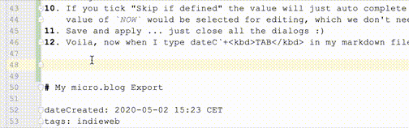
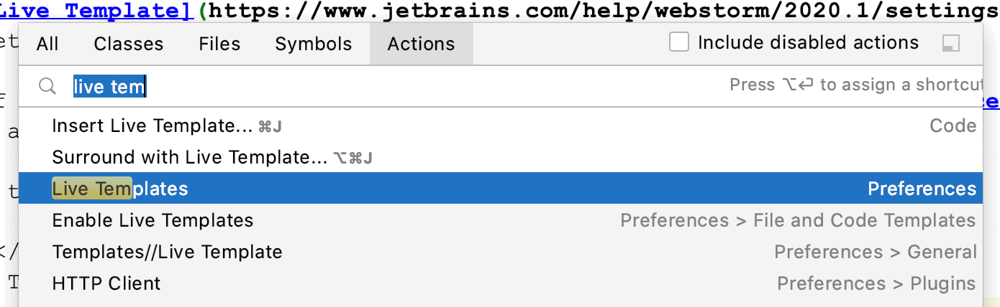
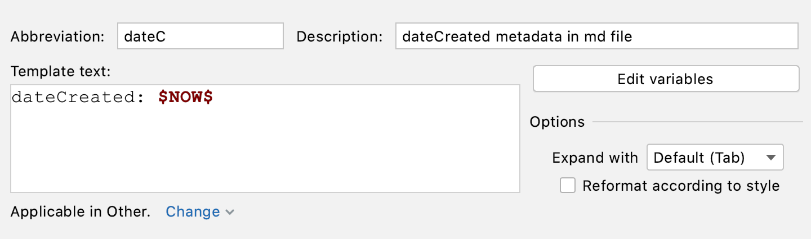
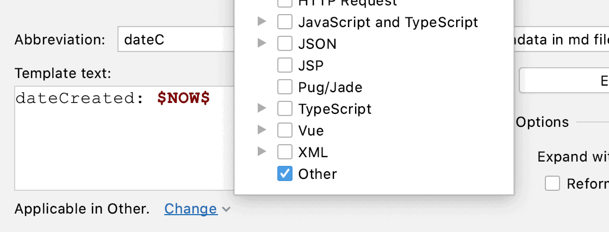
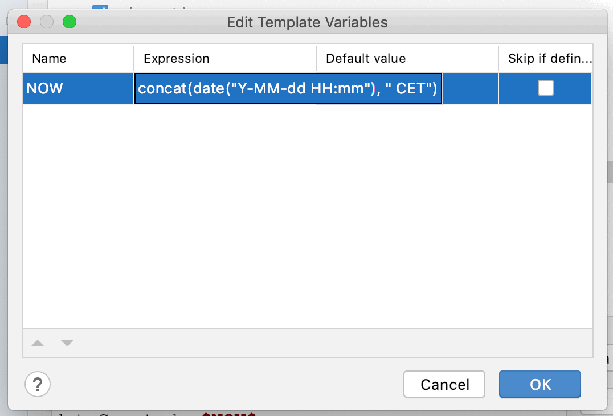

# WebStorm Live Templates Rock (Again)

tags: tools
dateCreated: 2020-05-02 15:27 CET

I created a [Live Template](https://www.jetbrains.com/help/webstorm/2020.1/settings-live-templates.html) 
to auto complete `dateC`+<kbd>TAB</kbd> to `dateCreated: 2020-05-02 15:27 CET`.

<figure>
    
    <figcaption>See Live Template in Action</figcaption>
</figure>

I got tired of writing the metadata, I am using here in my tidbits ([see the source](https://github.com/wolframkriesing/site-stitcher/tree/master/content))
over and over again, metadata such as the current `dateCreated`, as seen before.

How to create this Live Template?

1. <kbd>Shift</kbd> + <kbd>Cmd</kbd> + <kbd>A</kbd> (for "Find Action")
2. Type "Live Template"
3. Select the one with "Preferences" behind it
    <figure>
        
        <figcaption>Find Action screen in WebStorm</figcaption>
    </figure>
4. Create a new Live Template, <kbd>Cmd</kbd> + <kbd>N</kbd>, choose "Live Template"
5. Fill it in as in the image
    <figure>
        
        <figcaption>The editor for the live template</figcaption>
    </figure>
6. Make sure to set "Applicable ..." below the fields.
   Since I am using it in markdown files, which has no own section I chose "Other", see image
    <figure>
        
        <figcaption>Edit live template type</figcaption>
    </figure>
7. Note the `$NOW$`. This is a variable which does NOT exist yet, so let's create it to return 
   the `dateCreated` in the format you have seen above (`2020-05-02 15:27 CET`).
8. Click "Edit variables" on the right.
9. Reading a little bit in [the JetBrains docs](https://www.jetbrains.com/help/webstorm/2020.1/edit-template-variables-dialog.html)
   I found out very quickly that I need to set the value of the variable `NOW`
   to `concat(date("Y-MM-dd HH:mm"), " CET")`.
    <figure>
        
        <figcaption>Edit live template variable</figcaption>
    </figure>
10. If you tick "Skip if defined" the value will just auto complete and the Live Template is done (otherwise the inserted
    value of `NOW` would be selected for editing, which we don't need here)
11. Save and apply ... just close all the dialogs :)
12. Voila, now when I type dateC`+<kbd>TAB</kbd> in my markdown file I get the date.

    dateCreated: 2020-05-02 15:54 CET

# My micro.blog Export

dateCreated: 2020-05-02 15:23 CET
tags: indieweb

I just [exported the small number of posts as JSON (12 KB)](./my-microblog-export.json) I had on micro.blog.

# Accessibility (and) Tools

dateCreated: 2020-05-01
tag: a11y

Diving into the topic of accessibility I found so much more than I expected.
The first was the fact that ["About 1 in 5 people has some type of disability."](https://webmaster.tamu.edu/2015/04/28/7-things-you-should-know-about-web-accessibility/).
I always knew and fought for doing accessibility at least better than yesterday,
but effecting 20% by doing it badly can be painful, not only emotionally also for a business.

I found the [NY Times has a page on Accessibility](https://help.nytimes.com/hc/en-us/articles/115015727108-Accessibility)
so "as many readers as possible are able to enjoy The New York Times", not sure how many pages do that and care so much.

I also played around with the "ultimate power" that the user has on the client to control what a website might look like.
There is more than you expect.
<blockquote class="twitter-tweet" data-partner="tweetdeck">

It&#39;s so much fun to play around with my ultimate power over websites.  I am customizing my browser settings a bit, 
starting with the fonts. Diving into accessibility a bit more.
<a href="https://twitter.com/hashtag/a11y?src=hash&amp;ref_src=twsrc%5Etfw">#a11y</a> 
<a href="https://twitter.com/hashtag/webdesign?src=hash&amp;ref_src=twsrc%5Etfw">#webdesign</a> 
<a href="https://twitter.com/hashtag/web?src=hash&amp;ref_src=twsrc%5Etfw">#web</a> 
<a href="https://t.co/gHGEL2pujz">pic.twitter.com/gHGEL2pujz</a>
&mdash; @wolframkriesing <a href="https://twitter.com/wolframkriesing/status/1255833819476905986?ref_src=twsrc%5Etfw">April 30, 2020</a></blockquote>

While searching for tools to check beyond what lighthouse does, also so I can understand and learn
more about accessibility I came across the [Web Accessibility Evaluation Tools List](https://www.w3.org/WAI/ER/tools/)
on the W3C page it has **140 tools listed**. And again, I came across WebAIM.org, they have a great tool: 
[WAVE Web Accessibility Evaluation Tool](https://wave.webaim.org/) where you enter a URL and get the results for this page
with annontations on the page, see the image below.

<figure>
    
    <figcaption>WAVE, Accessibility Tool Result</figcaption>
</figure>
