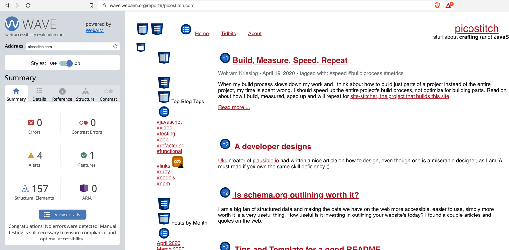

## May 1, 2020

### Accessibility (and) Tools

tag: a11y

Diving into the topic of accessibility I found so much more than I expected.
The first was the fact that ["About 1 in 5 people has some type of disability."](https://webmaster.tamu.edu/2015/04/28/7-things-you-should-know-about-web-accessibility/).
I always knew and fought for doing accessibility at least better than yesterday,
but effecting 20% by doing it badly can be painful, not only emotionally also for a business.

I found the [NY Times has a page on Accessibility](https://help.nytimes.com/hc/en-us/articles/115015727108-Accessibility)
so "as many readers as possible are able to enjoy The New York Times", not sure how many pages do that and care so much.

I also played around with the "ultimate power" that the user has on the client to control what a website might look like.
There is more than you expect.
<blockquote class="twitter-tweet" data-partner="tweetdeck">

It&#39;s so much fun to play around with my ultimate power over websites.  I am customizing my browser settings a bit, 
starting with the fonts. Diving into accessibility a bit more.
<a href="https://twitter.com/hashtag/a11y?src=hash&amp;ref_src=twsrc%5Etfw">#a11y</a> 
<a href="https://twitter.com/hashtag/webdesign?src=hash&amp;ref_src=twsrc%5Etfw">#webdesign</a> 
<a href="https://twitter.com/hashtag/web?src=hash&amp;ref_src=twsrc%5Etfw">#web</a> 
<a href="https://t.co/gHGEL2pujz">pic.twitter.com/gHGEL2pujz</a>
&mdash; @wolframkriesing <a href="https://twitter.com/wolframkriesing/status/1255833819476905986?ref_src=twsrc%5Etfw">April 30, 2020</a></blockquote>

While searching for tools to check beyond what lighthouse does, also so I can understand and learn
more about accessibility I came across the [Web Accessibility Evaluation Tools List](https://www.w3.org/WAI/ER/tools/)
on the W3C page it has **140 tools listed**. And again, I came across WebAIM.org, they have a great tool: 
[WAVE Web Accessibility Evaluation Tool](https://wave.webaim.org/) where you enter a URL and get the results for this page
with annontations on the page, see the image below.

<figure>
    
    <figcaption>WAVE, Accessibility Tool Result</figcaption>
</figure>
