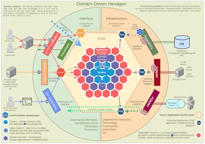

# How to Convert Images to webp (and use them)
slug: how-to-convert-images-to-webp
dateCreated: 2021-02-28 13:02 CET
tags: images, website, tools, images, webp
previewImage: ../webp-logo.png

A while ago I optimized some images for the site you are looking at, by using the 
[webp format](https://developers.google.com/speed/webp)
because I had forgotten to do that, and 
[PageSpeed Insights](https://developers.google.com/speed/pagespeed/insights/)
suggested to do so.  
I forgot how to do that, so I am writing it down now. Read on if you also want
to know how to convert any kind of image to webp and embed it in your site.

## Install the Executable

I am using a docker setup, so 
[I added](https://github.com/wolframkriesing/site-stitcher/commit/0351946d978a9973ead489233b512d1f6960ba6e)
the following line to my Dockerfile

```
# in Dockerfile
RUN apt-get -y install webp
```

This installs the webp binary inside this container.
The [description](https://developers.google.com/speed/webp/docs/cwebp) 
says. It

> compresses an image using the WebP format. Input format can be either PNG, JPEG, TIFF, WebP or raw Y'CbCr samples.   
> Note: Animated PNG and WebP files are not supported.

## Convert an Image to webp

Next I want to convert images I use on my site to be available in webp too.
[The command I use](https://github.com/wolframkriesing/site-stitcher/commit/0980190849d8faa13a1f83f431706436e2044f7d)
for that runs in the docker container where I added the webp executable to.
I run it via
```shell
cwebp -q 80 in.png -o out.webp
```

Where `-q 80` means reduce the quality to 80%, which I am fine with.
I don't want to fiddle around too much with the quality.
The parameter `in.png` is the original image, in this case a png, but it can be a jpg (or see above),
I had not had any problems with other image formats yet.

Finally `-o out.webp` is the file name of the resulting webp image.
For one of the images I just added I ran the following command:
```shell
cwebp -q 80 content/tidbit/2021/02/hexagonal-visual.png -o content/tidbit/2021/02/hexagonal-visual.webp
```

## Embed in the Site

In order for (older) browsers that do not yet support webp format, a bit of HTML is needed
to provide both image types. 

This is done like this:

```html
<figure>
    <picture>
        <source srcset="hexagonal-visual.webp">
        
    </picture>
    <figcaption>A hexagonal diagram</figcaption>
</figure>
```

The `<picture>` element contains multiple sources (the webp and the png image),
so the browser can choose the most appropriate one.
In short, a browser that does NOT support webp will use the other image.
Done.

Have fun.


# ArchUnit For JavaScript - archijs
slug: arch-unit-for-java-script-archijs
dateCreated: 2021-02-28 12:33 CET
tags: testing, architecture, software design

[Archijs](https://github.com/migh1/archijs#readme)
describes itself as "A package to test javascript architecture".

Use it in your project now, via:
```shell
yarn add archijs
```

and you can write a test like this
```js
const project = Archijs.parseFromPath("src"); 
const rule = Archijs
  .defineThat()
  .folder()
  .withNameMatching('actions')
  .should()
  .matchChildrensName('actions')

expect(project).toMatchArch(rule);
```


# Advices, not only for Rails Projects
slug: advices-not-only-for-rails-projects
dateCreated: 2021-02-27 23:11 CET
tags: architecture, software design, patterns

[What advice/rules I may give to junior developers about the Ruby on Rails app design?](https://medium.com/@Killavus/what-advice-rules-i-may-give-to-junior-developers-about-the-ruby-on-rails-app-design-6a129bd86b85)
This article is not only relevant for Rails developers, but also
very general. I feel that rails devs need more support here, because
Rails makes it especially hard to use magic.  
Make sure to open the hood and understand how the engine ticks!


# Hexagonal Architecture (in JavaScript)
slug: hexagonal-architecture-in-javascript
dateCreated: 2021-02-27 18:44 CET
tags: architecture, software design, patterns

The [original article where Alistair Cockburn describes 
Hexagonal architecture](https://alistair.cockburn.us/hexagonal-architecture/) 
is the best intro and a good read,
no matter what year it is.

The sentence
> First and worst, people tend not to take the “lines” in the layered drawing seriously. 
> They let the application logic leak across the layer boundaries

made me think that I want a linter for verifying that the code that is written
does not violate the architecture boundaries, and that for example
a port never uses a use case, but only the other way around.

## Arch(Unit)

Welcome ArchUnit. As I learned in 
[@Ted's video](#very-good-1h-in-depth)
there is [ArchUnit](https://www.archunit.org/use-cases) which allows writing unit tests for
exactly this, in Java. Fun fact, ArchUnit is maintained by TNG, a Munich-based company,
around the corner, an active Munich community member 👋🏽 over. (Soon we will all be back in person.)

There is even a JavaScript pendant for it ["archijs"](https://github.com/migh1/archijs#readme), 
looks like it didn't get much attention from the world yet. Let's change that. I write about it separately in
["ArchUnit For JavaScript - archijs"](../arch-unit-for-java-script-archijs/), 
so search engines will eventually find it too ☺️.

Back to hexagonal architecture as such.

## Primary and Secondary Actors

Alistair observed in applications he built, that there are two
types of actors.

> A "primary actor" is an actor that drives the application [...].  
> A "secondary actor" is one that the application drives

These actors are also reflected in what the hexagonal architecture diagram looks like.

> draw the "primary ports "and" primary adapters" on the left side (or top) of the hexagon, 
> and the "secondary ports" and "secondary adapters" on the right (or bottom) side of the hexagon

In the [video linked below](#naming-ports), 
he says that the difference between a primary and a secondary
actor is just "who initiates the conversation". The one who does is the primary actor.

## "How Many Ports?"

The headline is actually from his article and was one of the questions I had too.

> What exactly a port is and isn’t is largely a matter of taste.

Still he gives some good example. Where a port is something as abstract
like "trigger data" or "incoming events" or alike. These can be multiple things,
depending what the system does. But it shows a very abstract kind of port.
In another example he uses "user-site API" for the incoming data (primary port) and
"data-side API" for the outgoing (secondary port).

I read this as "think about it yourself and it might be very different for every app".
As usual, there is no one silver bullet.

## Naming Ports

[Alistair in the "Hexagone" 1/3](https://www.youtube.com/watch?v=th4AgBcrEHA) (youtube video, >30min)  
Alistair Cockburn talking (the first time) about Hexagonal Architecture
he takes the magic out of the word "ports" by:
> What's a "port"? It's an interface. Done
 
<iframe width="427" height="240" name="video" src="//www.youtube.com/embed/th4AgBcrEHA" frameborder="0" allowfullscreen></iframe>

A "translation" of port, or how to find what to call the port is
fill the gaps in "for ___ing", or as he says around minute 12
a "port is the intention of the dialog, it's not the technology"
That's why a port might be called "adding events" but never "reading kafka".

## The Test Case is the First User of your System

"A test case is the first user of your system"
That makes even so much more sense when you know hexagonal architecture.
Alistair says in the video around minute 29.

## Hexagonal and React (JavaScript)

Initially I started reading because I want to find a good example of how
someone uses React and hexagonal architecture. Yes, there are many examples
which show how flux and redux are hexagonal architecture. But I feel these are 
too often used in a way to create "store all things in global state and call it 
a redux store". I have not seen really good encapsulated examples of that yet.

One article I found is 
["Hexagonal architecture in JavaScript applications — and how it relates to Flux"](https://medium.com/@Killavus/hexagonal-architecture-in-javascript-applications-and-how-it-relates-to-flux-349616d1268d#.ik8250i7s)
I really like the readability of the code.
Once you understand what a port and a use case is, this makes so much sense.

## More Resources

### In Depth Post
[Hexagonal Architecture: three principles and an implementation example](https://blog.octo.com/en/hexagonal-architecture-three-principles-and-an-implementation-example/)  
This post contains helpful explanations and also good example code.
It even explains how to organize the code inside a method that works
with ports, adapters etc.

### Alistair Cockburn, Part 2 and 3
[Alistair in the "Hexagone" 2/3](https://www.youtube.com/watch?v=iALcE8BPs94)  
[Alistair in the "Hexagone" 3/3](https://www.youtube.com/watch?v=DAe0Bmcyt-4)  

### Very good 1h in depth
[More Testable Code with the Hexagonal Architecture](https://www.youtube.com/watch?v=ujb_O6myknY)
is a very detailed and well explained lesson. Also explaining many related terms.
By [@Ted M. Young](https://twitter.com/jitterted).
<iframe width="427" height="240" name="video" src="//www.youtube.com/embed/ujb_O6myknY" frameborder="0" allowfullscreen></iframe>

### A must see
It took me years to understand what he means with this. I mean I get the words,
the logic, I get the reasoning, but how to do it and understanding that there is still a lot
to learn before accomplishing this, it is not easy.
A Classic 
[J.B. Rainsberger - Integrated Tests Are A Scam](https://vimeo.com/80533536)
he sientifically proves why splitting up code, e.g. using hexagonal architecture, pays off.
<iframe src="https://player.vimeo.com/video/80533536" width="427" height="240" frameborder="0" webkitallowfullscreen mozallowfullscreen allowfullscreen></iframe>

### More Input from Output
[Searching for "hexagonal architecture"](https://twitter.com/search?q=%22hexagonal%20architecture%22&f=live)
on twitter reveals constantly new and interesting pieces of knowledge.

### Very nice Visualization

https://github.com/Sairyss/domain-driven-hexagon#Diagram

<figure>
    <picture>
        <source srcset="../hexagonal-visual.webp">
        
    </picture>
    <figcaption>A hexagonal diagram</figcaption>
</figure>


# Cancel a fetch request using AbortController
slug: cancel-fetch-request-using-abortcontroller
tags: web, react, fetch, JavaScript, HTTP
dateCreated: 2021-02-19 18:48 CET

Finally I learned how to abort a fetch, see the post
[React useEffect and fetch API](https://blog.fullsnackdev.com/post/react-use-effect-and-fetch/)
by [@Jaime](https://twitter.com/jaimefebres).

As easy as this:
```js
const controller = new AbortController();        
// we pass in a `signal` to `fetch` so that we can cancel the requests
fetch('http://example.com', { signal: controller.signal });
controller.abort();
```

Thanks Jaime!


# What's an "Unary" Operator?
slug: what-is-a-unary-operator
dateCreated: 2021-02-06 12:48 CET
tags: learning, words, knowledge, JavaScript
previewImage: ../unary-preview.png

Coming across "unary operators" might happen in JavaScript, or (m)any other programming language(s).
A couple examples for what is a "unary operator".  
In JavaScript you may find: `+1`, `-42`, `+ "1"`, `!true`, `delete x`.
All those are unary operators as you can also read on
[MDN](https://developer.mozilla.org/en-US/docs/Web/JavaScript/Reference/Operators#unary_operators)
and in the 
[spec](https://tc39.es/ecma262/#sec-unary-operators). **But what does the "unary" really mean?**
And why is `1 + 1` not using a unary operator?

## Definition
In [Merriam-Webster "unary" is defined like so](https://www.merriam-webster.com/dictionary/unary)
> having, consisting of, or acting on a single element, item, or component
 
The `+`, the `-`, the `!` or the `delete` are applied to one "element".
In spec terms, a unary "operator" is applied to one and only one variable, identifier or alike.
In `+1` the operator is the `+` and it is applied on the `1`. Because it is applied only to
one operand, in this case the `1`, it is a unary (not binary, not ternary, not quaternary) operator.

## What is the Opposite of "Unary"?
Just before I used "binary", "ternary" and "quaternary", because I jumped a little bit ahead.
I had asked myself what else "unary" does belong to, if there was something like "multi-nary" or alike.
So I hunted the web and found 
[the answer on english.stackexchange.com](https://english.stackexchange.com/questions/342557/is-there-a-word-like-unary-meaning-consisting-of-more-than-one-element).
This seems to be the place where people who know language(s) seem to hang out.

On that site exactly my question was asked and discussed
"Is there a word like “unary” meaning “consisting of *more than one* element”?".
The discussion of the term is short and insightful (not so full of trolling as the web sometimes offers).
And we end up in computer science space again, the final answer that leads me to 
the definition of "Arity" resolves all the mystery and clears up the space around the "??-ary"
word.

> You can use multiple-arity if different numbers of arguments are accepted (e.g. a polymorphic function/method), or n-ary if you want to be indefinite about the arity.

## Arity

The above is [the best answer](https://english.stackexchange.com/a/342560) on what the opposite or "unary" is,
it also links on to the 
[wikipedia article on "Arity"](https://en.wikipedia.org/wiki/Arity)
where one can go into depth and sees all the other arities, as touched on above.
The variable number of "elements", or arguments is called "n-ary" 
as [the according paragraph explains](https://en.wikipedia.org/wiki/Arity#n-ary).

## Back to JavaScript

Coming back to JavaScript. When reading about the 
["unary plus" on MDN](https://developer.mozilla.org/en-US/docs/Web/JavaScript/Reference/Operators/Unary_plus)
it is easier to understand now. 
The difference to
[the other "+"](https://developer.mozilla.org/en-US/docs/Web/JavaScript/Reference/Operators/Addition),
[the arithmetic operator](https://developer.mozilla.org/en-US/docs/Web/JavaScript/Reference/Operators#arithmetic_operators)
is not just the name but also the functionality.
The one adds two "things" (the arithmetic operator) and the other only converts one "thing" (the unary operator)
to a Number type.
This answers the second question I started with, about the difference to `1 + 1`.

Let's see three unary and one arithmetic operator in action:
```
> + '1'
1

> 1 + 1
2

> typeof + '1'
"number"
```
Are you seeing the three unary operators? Hint: `typeof` is also a unary operator.

## The ECMAScript Spec

<figure>
    <picture>
        <source srcset="../unary-spec.webp">
        
    </picture>
    <figcaption>ECMAScript Spec chapter on unary + operator</figcaption>
</figure>

Not very surprisingly the 
[spec also has the chapter "Unary + Operator"](https://tc39.es/ecma262/#sec-unary-plus-operator).
Understanding that this is not a JavaScript specific term, but seemingly even more computer science, 
even rooted in math takes away more of the fear of touching it, because the usefulness and possible application
of the term has just increased.

So far my learnings on "unary". If you find any errors or possible improvements let me know. I am always curious.


# Codeberg Repo as npm Dependency
slug: codeberg-repo-as-npm-dependency
dateCreated: 2021-02-03 00:25 CET
tags: npm, nodejs, JavaScript, codeberg
previewImage: ../codeberg-preview.jpeg

I am gladly using [codeberg](https://codeberg.org) (as github alternative)
for as many projects as I can, really support their mission.
"Independent and powered by your donations and contributions".  
I struggled a little bit [to figure out the URL that works](#how-it-works)
for a package
that is not on npm yet, but exists just as a codeberg repo.

## Npm Module From a Repo
Npm modules are normally installed via `npm install <package-name>`, but
this works only once the package is published on npm.
If I try to install `npm install test-stitcher`, this fails.

To work with a package straight from the repository one can also use a URL
as dependency, for a codeberg repo it works like this:
`npm install git+https://codeberg.org/wolframkriesing/test-stitcher.git`.
The URL is used as the package name, just the prefix "git+https" was what I had to 
try and play with until I figured it out.

## Failed Tries
I tried a lot of the known URL patterns as dependency in my `package.json`.   
**Those that failed** were:
* https://codeberg.org/wolframkriesing/test-stitcher.git
* git://codeberg.org/wolframkriesing/test-stitcher.git
* git@codeberg.org:wolframkriesing/test-stitcher.git
* git+ssh://git@codeberg.org/wolframkriesing/test-stitcher.git
* git+ssh://git@codeberg.org:wolframkriesing/test-stitcher.git
* git+https://codeberg.org/wolframkriesing/test-stitcher.git 

Just to quote one error that I received when I called `npm install`: 
```
> npm install
npm ERR! code ENOLOCAL
npm ERR! Could not install from "git@codeberg.org:wolframkriesing/test-stitcher.git" as it does not contain a package.json file.
```

## How it Works

The URL that **works** is prefixed with "git+https":
* git+https://codeberg.org/wolframkriesing/test-stitcher.git

```json
{
  "dependencies": {
    "test-stitcher": "git+https://codeberg.org/wolframkriesing/test-stitcher.git"
  }
}
```

I have not seen and used the combination "git" and "https" before, but hey if 
npm accepts this. Cool. hth


# React: Hooks vs. Saga
slug: react-hooks-vs-saga
dateCreated: 2021-02-02 14:31 CET
tags: react, tools, frontend, web, JavaScript

I am currently working on a React Native app that uses redux saga heavily.
My main concern with it is the traceability of code that goes together, the modularization. It is hard, if not impossible to know
what belongs together, what is needed in combination with what. 

Currently, the different parts, actions, sagas, etc. are spread
across multiple places in the source code. I prefer to have, things that belong together, in one place,
and whatever is shared across the code base I put in `shared-*` directories. If I have a "simple" API request that puts some
data in a store, the API request, its error handling and placing the data in the store goes in one place, best in one file.
If don't need it, I can delete it and my IDE can help me detect unused code.

## Learning From Others
So I searched for articles via ["react saga vs hooks"](https://duckduckgo.com/?t=canonical&q=react+saga+vs+hooks&ia=web)
to prove my bias, nah, to learn from others how they did it.

Even though I am not a big fan of react hooks either, since they impose so much magic on me and don't make testing stuff easy,
it's the better choice here. And, I actually have a way of testing the hooks in an acceptable manner.
(Reading this myself, I am bothered by the many tradeoffs the react ecosystem forces on me constantly, 
but that is a constant itch of mine, as my twitter timeline underlines.)

Rossi Tri Le wrote
[How I replace Redux, Redux Saga with React Hooks](https://medium.com/@rossitrile93/how-i-replace-redux-redux-saga-with-react-446b4c84f788)
> This article will show you how to easily and effectively replace redux, redux saga with React Hooks.

This sounds like the right thing.

> Most [...] use [...] useState/ useReducer, which is fine if you only need to make a few API calls. 
> But if you plan to go production, with a lot of API call, then maintaining the codebase with this approach will soon become a nightmare.

This sounds interesting. I want to learn how to prevent nightmares and still get away from sagas.
(I also think that generators are not fitting this problem well.)

> For the middleware, I am going to use a pure javascript function to replace it.
> Now we understand our problem, and have a plan to tackle it, let’s get started.

I really like the direction this is going.
I like it for two reasons:
1) The author seems not to **require** a framework for everything, nowadays I see too many programmers "needing"
   big tools to solve small problems.
2) The author states clearly what is the problem and lays out a plan This is so refreshing. Not just jumping in,
   coding away and figuring out on the way where one wants to go.
   
> I don’t directly pass the dispatch function down the component tree, but the actions function.

that was also one of the things that always bothered me. Why do I need to see the store inner workings in my
business logic code.

Oh, and the article, almost abruptly ends here.  
Unfortunately I did not learn why just using hooks ends in a nightmare, as the author mentioned above. I believe
sorting hooks properly together and splitting the "put in a store" part makes it well to handle, but I need
to gain more experience here.

There is a repo with the really simplified way of how to do it.
https://github.com/rossitrile/replace-redux-saga-by-react-hooks
Thanks Rossi. At least I got my assumptions confirmed. I am going down that route too.
